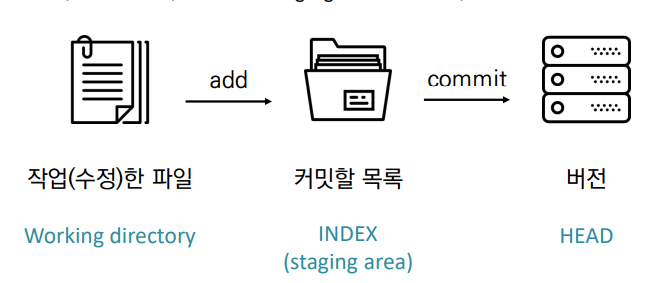

# Git

> 분산버전관리시스템

### 기본 흐름

1. 작업하면 

2. add하여 Staging area에 모아 

3. commit으로 버전기록

   

---

# git 실습


## 1. git 저장소 만들기(git init)

```bash
$ git init
Initialized empty Git repository in C:/Users/user/Desktop/test/.git/

 (master)
$
```

* `.git` 폴더가 생성되며, 버전이 관리되는 저장소
* git bash에서는 `(master)` 로 브랜치가 표기 된다.


## 2. 버전 만들기

### `add`

```bash
$ git add <파일/폴더/디렉토리>
$ git add . # 현재 디렉토리 변경 모두
$ git add a.txt   # 특정 파일
$ git add folder/ # 특정 폴더 
$ git add *.png   # 특정 확장자
```

#### 2-1. a.txt 파일 만들고 커밋하기

```bash
$ touch a.txt	#a.txt파일 생성
$ git status	#git 저장소에 있는 파일의 상태 확인
On branch master

No commits yet

Untracked files:
  (use "git add <file>..." to include in what will be committed)
        a.txt

nothing added to commit but untracked files present (use "git add" to track)

$ git add a.txt	#working directory상의 변경 내용을 	 					staging area에 추가

$ git status	#git 저장소에 있는 파일의 상태 확인
On branch master

No commits yet

Changes to be committed:
  (use "git rm --cached <file>..." to unstage)
        new file:   a.txt

$ git commit -m 'first version'	#staged 상태의 파일들을 								 커밋을 통해 버전으로 기록
[master (root-commit) cde4706] first version
 1 file changed, 0 insertions(+), 0 deletions(-)
 create mode 100644 a.txt

$ git log	#현재 저장소에 기록된 커밋을 조회
commit cde4706f488f3858ecda78ae30a8e32f21941261 (HEAD -> master)
Author: JeongJoon <wjdwns1227@naver.com>
Date:   Wed Sep 29 15:21:27 2021 +0900

    first version

```

#### 2-2. 임의의 파일을 만들고 커밋

```bash
$ touch b.txt

$ git status
On branch master
Untracked files:
  (use "git add <file>..." to include in what will be committed)
        b.txt

nothing added to commit but untracked files present (use "git add" to track)

$ git add b.txt

$ git status
On branch master
Changes to be committed:
  (use "git restore --staged <file>..." to unstage)
        new file:   b.txt

$ git commit -m 'second version'
[master e94af0c] second version
 1 file changed, 0 insertions(+), 0 deletions(-)
 create mode 100644 b.txt

$ git log
commit e94af0c365a02bc0b57eba6cce9619cdcc917ec0 (HEAD -> master)
Author: JeongJoon <wjdwns1227@naver.com>
Date:   Wed Sep 29 15:27:20 2021 +0900

    second version

commit cde4706f488f3858ecda78ae30a8e32f21941261
Author: JeongJoon <wjdwns1227@naver.com>
Date:   Wed Sep 29 15:21:27 2021 +0900

    first version


```

#### 2-3. a.txt 수정하고 커밋하기

```bash
a.txt 파일 수정

$ git status
On branch master
Changes not staged for commit:	#커밋할 단계가 아니다
  (use "git add <file>..." to update what will be committed)
  (use "git restore <file>..." to discard changes in working directory)
        modified:   a.txt	

no changes added to commit (use "git add" and/or "git commit -a")

$ git add a.txt

$ git status
On branch master
Changes to be committed:	#커밋할 수 있다
  (use "git restore --staged <file>..." to unstage)
        modified:   a.txt

$ git commit -m 'third version'
[master e00c7a3] third version
 1 file changed, 1 insertion(+)

$ git log
commit e00c7a37134c65c766e32889b452c71d1662a65d (HEAD -> master)
Author: JeongJoon <wjdwns1227@naver.com>
Date:   Wed Sep 29 15:30:55 2021 +0900

    third version

commit e94af0c365a02bc0b57eba6cce9619cdcc917ec0
Author: JeongJoon <wjdwns1227@naver.com>
Date:   Wed Sep 29 15:27:20 2021 +0900

    second version

commit cde4706f488f3858ecda78ae30a8e32f21941261
Author: JeongJoon <wjdwns1227@naver.com>
Date:   Wed Sep 29 15:21:27 2021 +0900

    first version

$ git log -1	# -1 : 최근 마지막으로 커밋한 버전을 log
commit e00c7a37134c65c766e32889b452c71d1662a65d (HEAD -> master)
Author: JeongJoon <wjdwns1227@naver.com>
Date:   Wed Sep 29 15:30:55 2021 +0900

    third version

$ git log --oneline	# --oneline : 커밋한 내용을 한줄로
e00c7a3 (HEAD -> master) third version
e94af0c second version
cde4706 first version

```

