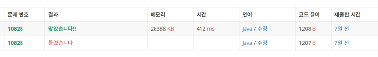

<자바에서 스택라이브러리 활용하기>



**스택** **성공**

| **시간 제한** | **메모리 제한** | **제출** | **정답** | **맞은 사람** | **정답 비율** |
| ------------- | --------------- | -------- | -------- | ------------- | ------------- |
| 1 초          | 256 MB          | 43640    | 17748    | 13145         | 40.886%       |

**문제**

정수를 저장하는 스택을 구현한 다음, 입력으로 주어지는 명령을 처리하는 프로그램을 작성하시오.

명령은 총 다섯 가지이다.

push X: 정수 X를 스택에 넣는 연산이다.

pop: 스택에서 가장 위에 있는 정수를 빼고, 그 수를 출력한다. 만약 스택에 들어있는 정수가 없는 경우에는 -1을 출력한다.

size: 스택에 들어있는 정수의 개수를 출력한다.

empty: 스택이 비어있으면 1, 아니면 0을 출력한다.

top: 스택의 가장 위에 있는 정수를 출력한다. 만약 스택에 들어있는 정수가 없는 경우에는 -1을 출력한다.

**입력**

첫째 줄에 주어지는 명령의 수 N (1 ≤ N ≤ 10,000)이 주어진다. 둘째 줄부터 N개의 줄에는 명령이 하나씩 주어진다. 주어지는 정수는 1보다 크거나 같고, 100,000보다 작거나 같다. 문제에 나와있지 않은 명령이 주어지는 경우는 없다.

**출력**

출력해야하는 명령이 주어질 때마다, 한 줄에 하나씩 출력한다.

**[출처]** [백준(BOJ) 10828 - 스택 (단계별로 풀기 - 스택 사용하기 (기초)) // java](https://blog.naver.com/tlstjd436/221515434425)|**작성자** [누스타](https://blog.naver.com/tlstjd436)

**문제 풀이**

스택에 가장 기본적인 개념만 알고 있으면 풀 수 있다.

자바를 사용했기 때문에 직접 스택을 구현하지는 않았고, 자바에서 제공하는 스택 라이브러리를 활용 했다.


이 상태로 처음에 초기화해놓고 사용하면 훨씬 사용하기 쉽다.


push : stack.push(int형 데이터) 스택에 데이터를 삽입하는 경우

pop : stack.pop() 스택은 LIFO형이기 때문에 제일 마지막에 입력한 수가 나온다.

----->1,2,3 을 넣었다면 3이 출력

emtpy : stack.isEmpty() 비었는지 확인, 아무것도 넣지 않았다면 비어있는걸로 판단

size : stack.size()를 사용하면 바로 stack에 몇개에 데이터가 있는지 확인 가능!

top : 실제 제공되는 라이브러이에서는 이부분만 다름 

-----> stack.peek() 이걸하면 제일 위에있는 값을 알 수 있는데,

----->1,2,3이 들어있다면 3이 젤 위에 있다!

**예제** 

| 예제 입력1                                                   | 예제 출력1              |
| ------------------------------------------------------------ | ----------------------- |
| 14 push 1 push 2 top size empty pop pop pop size empty pop push 3 empty top | 2 2 0 2 1 -1 0 1 -1 0 3 |

**예제2**

| 예제 입력2                         | 예제 출력2          |
| ---------------------------------- | ------------------- |
| 7 pop top push 123 top pop top pop | -1 -1 123 123 -1 -1 |

****

**소스코드**

```java
import java.util.ArrayList;
import java.util.Arrays;
import java.util.Scanner;
import java.util.Stack;

public class Main {

	public static void main(String[] args) {
		Scanner sc = new Scanner(System.in);
//		sc = new Scanner(src);

		int N = sc.nextInt();
		Stack<Integer> stack = new Stack<Integer>();

		for (int i = 0; i < N; i++) {
			String oper = sc.next();
			if (oper.equals("push")) {
				int a = sc.nextInt();
				stack.add(a);
			} else if (oper.equals("pop")) {
				int tmp=-1;
				if (!stack.isEmpty()) {
					tmp = stack.pop();
				}
				System.out.println(tmp);
			}else if(oper.equals("size")){
				System.out.println(stack.size());
			}else if(oper.equals("empty")) {
				int tmp = 0;
				if(stack.isEmpty()) {
					tmp = 1;
				}
				System.out.println(tmp);
			}else if(oper.equals("top")){
				int tmp = -1;
				if(!stack.isEmpty()) {
					tmp = stack.peek();
				}
				System.out.println(tmp);
			}
		}

	}

	private static String src = "14\r\n" + "push 1\r\n" + "push 2\r\n" + "top\r\n" + "size\r\n" + "empty\r\n"
			+ "pop\r\n" + "pop\r\n" + "pop\r\n" + "size\r\n" + "empty\r\n" + "pop\r\n" + "push 3\r\n" + "empty\r\n"
			+ "top";
}

```


