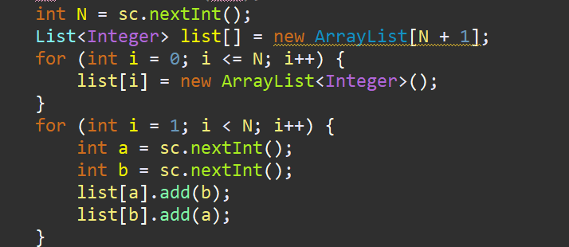
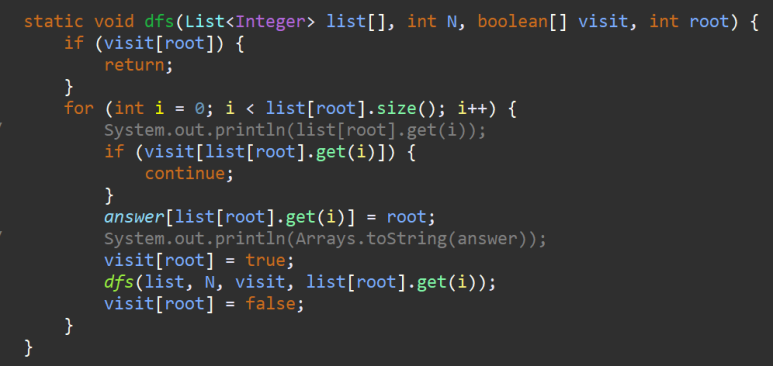

**문제**

루트 없는 트리가 주어진다. 이때, 트리의 루트를 1이라고 정했을 때, 각 노드의 부모를 구하는 프로그램을 작성하시오.

**입력**

첫째 줄에 노드의 개수 N (2 ≤ N ≤ 100,000)이 주어진다. 둘째 줄부터 N-1개의 줄에 트리 상에서 연결된 두 정점이 주어진다.

**출력**

첫째 줄부터 N-1개의 줄에 각 노드의 부모 노드 번호를 2번 노드부터 순서대로 출력한다.

| 7 1 6 6 3 3 5 4 1 2 4 4 7 | 4 6 1 3 1 4 | 12 1 2 1 3 2 4 3 5 3 6 4 7 4 8 5 9 5 10 6 11 6 12 | 1 1 2 3 3 4 4 5 5 6 6 |
| ------------------------- | ----------- | ------------------------------------------------- | --------------------- |
| 입력                      | 출력        | 입력                                              | 출력                  |

**문제 풀이**

이 문제는 트리를 그려보면 바로 정답이 나온다.

ArrayList와를 이용하여 그래프를 그려주고 이후, DFS로 탐색하면 빠르게 해결할 수 있다.


**1**

ArrayList 배열을 이용해 그래프를 만들어준다.




**2**

DFS를 이용하여 깊이 우선 탐색을 진행한다.


먼저 이미 root가 방문한 곳이라면 재방문할 필요가 없으니 return해준다.

두번째로 list[root]의 연결되어져있는 edge들을 탐색하고 문제가 없다면 answer 배열에 덮어씌워준다.




> 알고리즘 : DFS, 그래프 이론
>
> GitHub : https://github.com/shinsung3

https://github.com/shinsung3/Algorithm-BOJ-/blob/master/com.algorithm.java/src/Silver2/Main_11725.java

[](https://github.com/shinsung3/Algorithm-BOJ-/blob/master/com.algorithm.java/src/Silver2/Main_11725.java)[**Algorithm-BOJ-/Main_11725.java at master · shinsung3/Algorithm-BOJ-**백준 알고리즘 문제풀이. Contribute to shinsung3/Algorithm-BOJ- development by creating an account on GitHub.github.com](https://github.com/shinsung3/Algorithm-BOJ-/blob/master/com.algorithm.java/src/Silver2/Main_11725.java)

**전체 소스코드**

```java
package Silver2;

import java.util.ArrayList;
import java.util.Arrays;
import java.util.List;
import java.util.Scanner;

public class Main_11725 {
	static int[] answer;

	public static void main(String[] args) {
		Scanner sc = new Scanner(System.in);
//		sc = new Scanner(src);
		int N = sc.nextInt();
		List<Integer> list[] = new ArrayList[N + 1];
		for (int i = 0; i <= N; i++) {
			list[i] = new ArrayList<Integer>();
		}
		for (int i = 1; i < N; i++) {
			int a = sc.nextInt();
			int b = sc.nextInt();
			list[a].add(b);
			list[b].add(a);
		}
//		for (List<Integer> a : list) {
//			System.out.println(a);
//		}
		boolean[] visit = new boolean[N + 1];
		answer = new int[N + 1];
		dfs(list, N, visit, 1);
		for (int i = 2; i < answer.length; i++) {
			System.out.println(answer[i]);
		}
	}

	static void dfs(List<Integer> list[], int N, boolean[] visit, int root) {
		if (visit[root]) {
			return;
		}
		for (int i = 0; i < list[root].size(); i++) {
//			System.out.println(list[root].get(i));
			if (visit[list[root].get(i)]) {
				continue;
			}
			answer[list[root].get(i)] = root;
//			System.out.println(Arrays.toString(answer));
			visit[root] = true;
			dfs(list, N, visit, list[root].get(i));
			visit[root] = false;
		}
	}

	static String src = "7\r\n" + "1 6\r\n" + "6 3\r\n" + "3 5\r\n" + "4 1\r\n" + "2 4\r\n" + "4 7";
}
```

