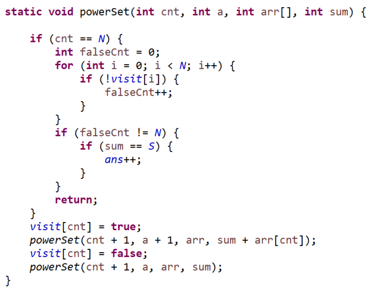

**문제**

N개의 정수로 이루어진 수열이 있을 때, 길이가 양수인 부분수열 중에서 그 수열의 원소를 다 더한 값이 S가 되는 경우의 수를 구하는 프로그램을 작성하시오.

**문제풀이**

부분 집합을 구하면 간단할 거라고 생각해서 재귀를 돌면서 Power Set을 구했다.

시간을 고려해봤을때 1000000개라서 조금 걱정했는데, 2초길래 뭔가 괜찮을거라는 생각에 그냥 풀었다.

재귀는 성공적이었다.


밑에 소스코드를 보기 전에 부분집합을 만드는 재귀함수를 참고하면 좋겠다

방문이 모두 false였을 경우, = 공집합의 경우는 제외하고 계산해야 한다.


**<부분집합을 구하는 재귀함수를 외워두는 편이 좋겠다.>**



**입력**

첫째 줄에 정수의 개수를 나타내는 N과 정수 S가 주어진다. (1 ≤ N ≤ 20, |S| ≤ 1,000,000) 둘째 줄에 N개의 정수가 빈 칸을 사이에 두고 주어진다. 주어지는 정수의 절댓값은 100,000을 넘지 않는다.

**출력**

첫째 줄에 합이 S가 되는 부분수열의 개수를 출력한다.

**예제 입력 1** 

5 0 -7 -3 -2 5 8 

**예제 출력 1** 

1

**소스코드** 

```java
import java.util.Arrays;
import java.util.Scanner;

public class Main {

	static int N;
	static int S;

	public static void main(String[] args) {
		Scanner sc = new Scanner(System.in);
//		sc = new Scanner(src);

		N = sc.nextInt();
		S = sc.nextInt();

		int arr[] = new int[N];

		for (int i = 0; i < N; i++) {
			arr[i] = sc.nextInt();
		}
		visit = new boolean[N];
		powerSet(0, 0, arr, 0);
		System.out.println(ans);

	}

	static boolean visit[];
	static int ans;

	static void powerSet(int cnt, int a, int arr[], int sum) {

		if (cnt == N) {
			int falseCnt = 0;
			for (int i = 0; i < N; i++) {
				if (!visit[i]) {
					falseCnt++;
				}
			}
			if (falseCnt != N) {
				if (sum == S) {
					ans++;
				}
			}
			return;
		}
		visit[cnt] = true;
		powerSet(cnt + 1, a + 1, arr, sum + arr[cnt]);
		visit[cnt] = false;
		powerSet(cnt + 1, a, arr, sum);
	}

	private static String src = "5 0\r\n" + "-7 -3 -2 5 8";
}
```

