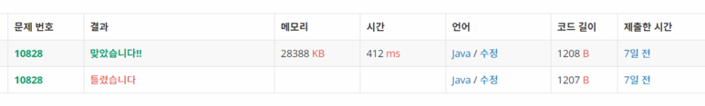

**문제**

김형택은 탑문고의 직원이다. 김형택은 계산대에서 계산을 하는 직원이다. 김형택은 그날 근무가 끝난 후에, 오늘 판매한 책의 제목을 보면서 가장 많이 팔린 책의 제목을 칠판에 써놓는 일도 같이 하고 있다.

오늘 하루 동안 팔린 책의 제목이 입력으로 들어왔을 때, 가장 많이 팔린 책의 제목을 출력하는 프로그램을 작성하시오.

**문제풀이**

사용한 collection이 좀 많았던 문제!

**1**

중복되지 않도록 **HashSet에 문자열을 넣어주고 리스트에 String,int 2가지를 저장**해준다!

set안에 포함되어져있는 숫자라면 int만 상승시켜서 찾아준다!




**2**

문자열의 숫자가 같다면 사전순으로가장 먼저 오는 걸 출력하기로 했으므로

**PriorityQueue** 사용!


https://github.com/shinsung3/Algorithm-BOJ-/blob/master/Main_1302.java

[](https://github.com/shinsung3/Algorithm-BOJ-/blob/master/Main_1302.java)[ **shinsung3/Algorithm-BOJ-**백준 알고리즘 문제풀이. Contribute to shinsung3/Algorithm-BOJ- development by creating an account on GitHub.github.com](https://github.com/shinsung3/Algorithm-BOJ-/blob/master/Main_1302.java)

**입력**

첫째 줄에 오늘 하루 동안 팔린 책의 개수 N이 주어진다. 이 값은 1,000보다 작거나 같은 자연수이다. 둘째부터 N개의 줄에 책의 제목이 입력으로 들어온다. 책의 제목의 길이는 50보다 작거나 같고, 알파벳 소문자로만 이루어져 있다.

**출력**

첫째 줄에 가장 많이 팔린 책의 제목을 출력한다. 만약 가장 많이 팔린 책이 여러 개일 경우에는 사전 순으로 가장 앞서는 제목을 출력한다.

**예제 입력 1** 

5 top top top kimtop 

**예제 출력 1** 

top

**소스코드**

```java
import java.util.ArrayList;
import java.util.HashSet;
import java.util.List;
import java.util.PriorityQueue;
import java.util.Scanner;

public class Main {

	public static void main(String[] args) {
		Scanner sc = new Scanner(System.in);
//		sc = new Scanner(src);
		int N = sc.nextInt();
		sc.nextLine();
		List<Node> list = new ArrayList<>();
		HashSet<String> set = new HashSet<>();
		for(int i=0; i<N; i++) {
			String line = sc.nextLine();
			
			if(set.contains(line)) {
				for(int ii=0; ii<list.size(); ii++) {
					if(list.get(ii).line.equals(line)) {
						Node nn = list.remove(ii);
						String a = nn.line;
						int b = nn.idx+1;
						list.add(new Node(a,b));
					}
				}
			}else {
				list.add(new Node(line, 1));
				set.add(line);
			}
		}
		
		int max=0;
		int index = 0;
		
		PriorityQueue<String> q = new PriorityQueue<>();

		for(int i=0; i<list.size(); i++) {
			if(list.get(i).idx>max) {
				max = list.get(i).idx;
				index = i;
			}
		}

		for(int i=0; i<list.size(); i++){
			if(list.get(i).idx==max) {
				q.add(list.get(i).line);
			}
		}
		
		System.out.println(q.remove());
	}
	
	static class Node{
		String line;
		int idx;
		public Node(String line, int idx) {
			super();
			this.line = line;
			this.idx = idx;
		}
		@Override
		public String toString() {
			return "Node [line=" + line + ", idx=" + idx + "]";
		}
	}

	private static String src = "5\r\n" + 
			"top\r\n" + 
			"top\r\n" + 
			"top\r\n" + 
			"top\r\n" + 
			"kimtop";
}
```

