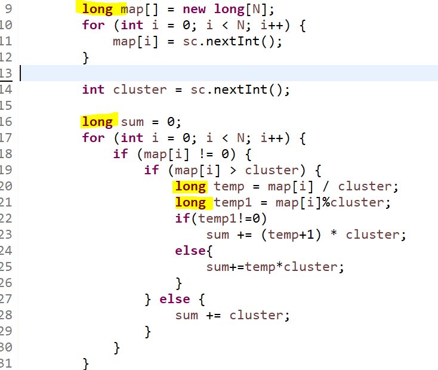

**문제**

어떤 파일 시스템에는 디스크 공간이 파일의 사이즈와 항상 같지는 않다. 이것은 디스크가 일정한 크기의 클러스터로 나누어져 있고, 한 클러스터는 오직 한 파일만 이용할 수 있기 때문이다.

예를 들어, 클러스터의 크기가 512바이트이고, 600바이트 파일을 저장하려고 한다면, 두 개의 클러스터에 저장하게 된다. 두 클러스터는 다른 파일과 공유할 수 없기 때문에, 디스크 사용 공간은 1024바이트가 된다.

파일의 사이즈와 클러스터의 크기가 주어질 때, 사용한 디스크 공간을 출력하는 프로그램을 작성하시오.

**문제풀이**

간단한 문제지만 **항상 크기를 고려해야 한다는 걸 잊으면 안된다**!

**int로 하면 틀리고, long으로 하면 맞는다**!



https://github.com/shinsung3/Algorithm-BOJ-/blob/master/Main_1350.java

[](https://github.com/shinsung3/Algorithm-BOJ-/blob/master/Main_1350.java)[ **shinsung3/Algorithm-BOJ-**백준 알고리즘 문제풀이. Contribute to shinsung3/Algorithm-BOJ- development by creating an account on GitHub.github.com](https://github.com/shinsung3/Algorithm-BOJ-/blob/master/Main_1350.java)

**입력**

첫째 줄에 파일의 개수 N이 주어진다. N은 1,000보다 작거나 같은 자연수이다. 둘째 줄에는 파일의 크기가 공백을 사이에 두고 하나씩 주어진다. 파일의 크기는 1,000,000,000보다 작거나 같은 음이 아닌 정수이다. 마지막 줄에는 클러스터의 크기가 주어진다. 이 값은 1,048,576보다 작거나 같은 자연수이다.

**출력**

첫째 줄에 사용한 디스크 공간을 출력한다.

**예제 입력 1** 

1 600 512 

**예제 출력 1** 

1024 

**예제 입력 2** 

5 16 32 128 128 0 32768 

**예제 출력 2** 

131072

**소스코드**

```java
import java.util.Scanner;

public class Main {

	public static void main(String[] args) {
		Scanner sc = new Scanner(System.in);
		sc = new Scanner(src);
		int N = sc.nextInt();
		long map[] = new long[N];
		for (int i = 0; i < N; i++) {
			map[i] = sc.nextInt();
		}

		int cluster = sc.nextInt();

		long sum = 0;
		for (int i = 0; i < N; i++) {
			if (map[i] != 0) {
				if (map[i] > cluster) {
					long temp = map[i] / cluster;
					long temp1 = map[i]%cluster;
					if(temp1!=0)
						sum += (temp+1) * cluster;
					else{
						sum+=temp*cluster;
					}
				} else {
					sum += cluster;
				}
			}
		}
		System.out.println(sum);

	}

	private static String src = "5\r\n" + 
			"16 32 128 128 0\r\n" + 
			"32768";
}
```

