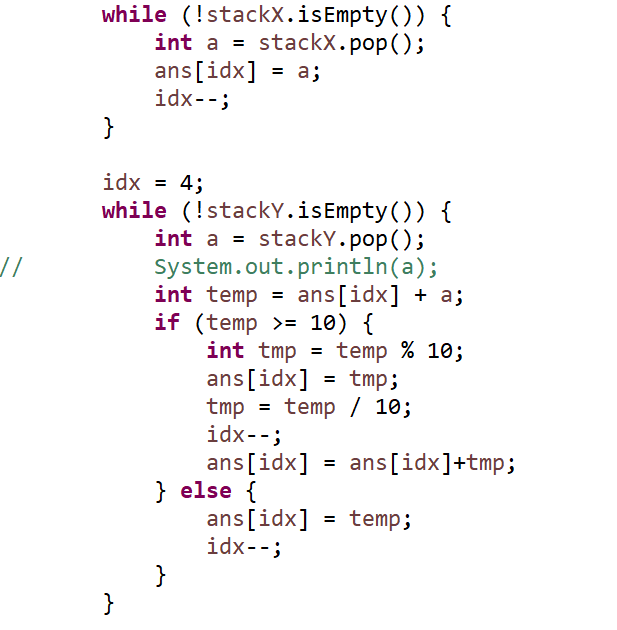

**문제**

어떤 수 X가 주어졌을 때, X의 모든 자리수가 역순이 된 수를 얻을 수 있다. Rev(X)를 X의 모든 자리수를 역순으로 만드는 함수라고 하자. 예를 들어, X=123일 때, Rev(X) = 321이다. 그리고, X=100일 때, Rev(X) = 1이다.

두 양의 정수 X와 Y가 주어졌을 때, Rev(Rev(X) + Rev(Y))를 구하는 프로그램을 작성하시오

**문제풀이**

A : 원래의 값,  B : 원래의 값

C : (A의 뒤집어진 값) + (B의 뒤집어진 값)

정답 : C의 뒤집어진 값 !


**ex) A: 572 B: 500**

**-> C: 275 + 5 = 280**

**-> 82**

****

**<stack사용>**



https://github.com/shinsung3/Algorithm-BOJ-/blob/master/Main_1357.java

[](https://github.com/shinsung3/Algorithm-BOJ-/blob/master/Main_1357.java)[ **shinsung3/Algorithm-BOJ-**백준 알고리즘 문제풀이. Contribute to shinsung3/Algorithm-BOJ- development by creating an account on GitHub.github.com](https://github.com/shinsung3/Algorithm-BOJ-/blob/master/Main_1357.java)

**입력**

첫째 줄에 수 X와 Y가 주어진다. X와 Y는 1,000보다 작거나 같은 자연수이다.

**출력**

첫째 줄에 문제의 정답을 출력한다.

**예제 입력 1** 

123 100 

**예제 출력 1** 

223

**소스코드**

```java
import java.util.Arrays;
import java.util.Scanner;
import java.util.Stack;
import java.util.StringTokenizer;

public class Main {

	static final int N = 100;
	static int ans;

	public static void main(String[] args) {
		Scanner sc = new Scanner(System.in);
//		sc = new Scanner(src);

		String line = sc.nextLine();

		StringTokenizer token = new StringTokenizer(line);

		String X = token.nextToken();
//		System.out.println(X);
		String Y = token.nextToken();

		Stack<Integer> stackX = new Stack<>();
		Stack<Integer> stackY = new Stack<>();

		for (int i = X.length()-1; i >=0; i--) {
			stackX.push(X.charAt(i) - '0');
		}

		for (int i = Y.length()-1; i >=0; i--) {
			stackY.push(Y.charAt(i) - '0');
		}

		int[] ans = new int[5];
//		System.out.println(stackX+" "+stackY);

		int idx = 4;
		while (!stackX.isEmpty()) {
			int a = stackX.pop();
			ans[idx] = a;
			idx--;
		}

		idx = 4;
		while (!stackY.isEmpty()) {
			int a = stackY.pop();
//			System.out.println(a);
			int temp = ans[idx] + a;
			if (temp >= 10) {
				int tmp = temp % 10;
				ans[idx] = tmp;
				tmp = temp / 10;
				idx--;
				ans[idx] = ans[idx]+tmp;
			} else {
				ans[idx] = temp;
				idx--;
			}
		}

//		System.out.println(Arrays.toString(ans));
		String answer = "";
		boolean flag = false;
		for (int i = 0; i<ans.length; i++) {
			if (!flag) {
				if (ans[i] != 0) {
//					System.out.print(ans[i]);
					answer+=ans[i];
					flag = true;
				}
			}else {
//				System.out.print(ans[i]);
				answer+=ans[i];
			}
		}
//		System.out.println(answer);
		flag = false;
		for(int i=answer.length()-1; i>=0; i--) {
			if (!flag) {
				if (answer.charAt(i)!='0') {
					System.out.print(answer.charAt(i));
					flag = true;
				}
			}else {
				System.out.print(answer.charAt(i));
			}
		}
	}

	private static String src = "123 100";
}
```

