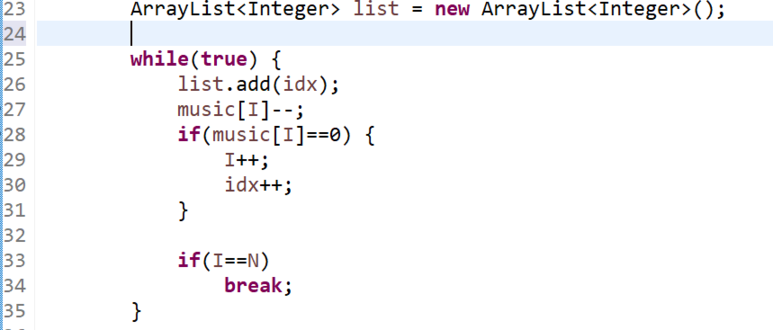

**문제**

현수는 학생들에게 노래를 가르치고 있다. 총 N개의 악보가 있고 i번째 악보는 Bi초로 이루어져 있다. 학생들은 0초부터 1번 악보를 따라 노래하기 시작했다. 즉 B1-1초에 1번 악보를 끝마치게 되고 B1초부터 B1+B2-1초까지 2번 악보를 따라 부르게 된다.

| 악보 | 1    | 1    | 2    | 3    | 3    | 3    |
| ---- | ---- | ---- | ---- | ---- | ---- | ---- |
| 시간 | 0    | 1    | 2    | 3    | 4    | 5    |

문제는 T1부터 TQ까지 Q개의 시간에 대해 대답을 하는 것인데, Ti초 때 노래하는 악보를 i번째에 출력하는 것이다.

**문제풀이**

문제 이해하는 것은 넘나리 어렵지만! 이해만 하면 넘나 간단하다!

악보의 수만큼 빼주며 list에 저장해주면 순서대로 저장이 된다는 사실!

시간은 순서대로 악보는 자신의 값만큼 사용이 되면 커진다!


**<ArrayList 사용해서 간단하게 해결!>**



https://github.com/shinsung3/Algorithm-BOJ-/blob/master/Main_1392.java

[](https://github.com/shinsung3/Algorithm-BOJ-/blob/master/Main_1392.java)[ **shinsung3/Algorithm-BOJ-**백준 알고리즘 문제풀이. Contribute to shinsung3/Algorithm-BOJ- development by creating an account on GitHub.github.com](https://github.com/shinsung3/Algorithm-BOJ-/blob/master/Main_1392.java)

**입력**

첫 줄에는 악보 수 N(1 ≤ N ≤ 100)과 질문의 개수 Q(1 ≤ Q ≤ 1,000)가 주어진다. 다음 N개의 줄에는 1번 악보부터 N번 악보까지 각 악보가 차지하는 시간(초)이 한 줄에 하나씩 주어진다. 각 악보가 차지하는 시간은 100 이하의 정수이다. 다음 Q개의 줄에는 알고자 하는 Q개의 시간(초)이 한 줄에 하나씩 주어진다. 묻는 시간 역시 정수만 주어진다.

**출력**

Q개에 줄에 1번 질문부터 Q번 질문까지 해당 시간(초)에 부르는 악보의 번호를 출력한다.

**예제 입력 1** 

3 5 2 1 3 2 3 4 0 1 

**예제 출력 1** 

2 3 3 1 1

**소스코드**

```java
import java.util.ArrayList;
import java.util.Scanner;

public class Main {
	public static void main(String[] args) {
		Scanner sc = new Scanner(System.in);
//		sc = new Scanner(src);
		int N = sc.nextInt();
		int Q = sc.nextInt();
		
		int music[] = new int[N];
		int time[] = new int[Q];
		for(int i=0; i<N; i++) {
			music[i] = sc.nextInt();
		}
		
		for(int j=0; j<Q; j++) {
			time[j] = sc.nextInt();
		}
		
		int idx=1;
		int I = 0;
		ArrayList<Integer> list = new ArrayList<Integer>();
		
		while(true) {
			list.add(idx);
			music[I]--;
			if(music[I]==0) {
				I++;
				idx++;
			}
			
			if(I==N)
				break;
		}
		
		for(int i=0; i<time.length; i++) {
			System.out.println(list.get(time[i]));
		}
	}

	private static String src = "3 5\r\n" + 
			"2\r\n" + 
			"1\r\n" + 
			"3\r\n" + 
			"2\r\n" + 
			"3\r\n" + 
			"4\r\n" + 
			"0\r\n" + 
			"1";
}
```

