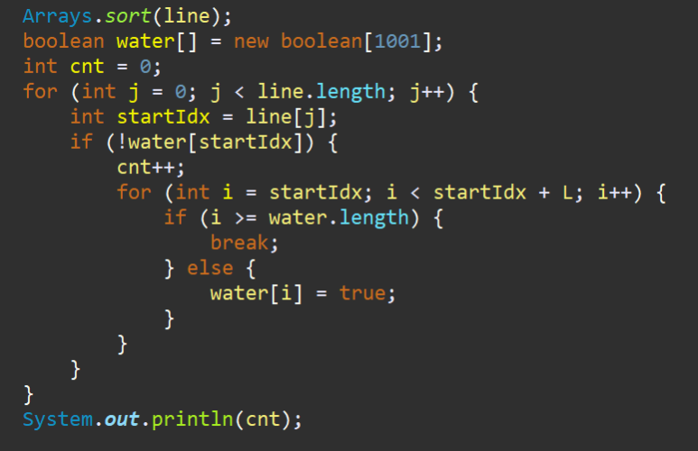

**문제**

항승이는 품질이 심각하게 나쁜 수도 파이프 회사의 수리공이다. 항승이는 세준 지하철 공사에서 물이 샌다는 소식을 듣고 수리를 하러 갔다.

파이프에서 물이 새는 곳은 신기하게도 가장 왼쪽에서 정수만큼 떨어진 거리만 물이 샌다.

항승이는 길이가 L인 테이프를 무한개 가지고 있다.

항승이는 테이프를 이용해서 물을 막으려고 한다. 항승이는 항상 물을 막을 때, 적어도 그 위치의 좌우 0.5만큼 간격을 줘야 물이 다시는 안 샌다고 생각한다.

물이 새는 곳의 위치와, 항승이가 가지고 있는 테이프의 길이 L이 주어졌을 때, 항승이가 필요한 테이프의 최소 개수를 구하는 프로그램을 작성하시오. 테이프를 자를 수 없고, 테이프를 겹쳐서 붙이는 것도 가능하다.

**입력**

첫째 줄에 물이 새는 곳의 개수 N과 테이프의 길이 L이 주어진다. 둘째 줄에는 물이 새는 곳의 위치가 주어진다. N과 L은 1,000보다 작거나 같은 자연수이고, 물이 새는 곳의 위치는 1,000보다 작거나 같은 자연수이다.

**출력**

첫째 줄에 항승이가 필요한 테이프의 개수를 출력한다.

| **입력**        | **출력** |
| --------------- | -------- |
| 4 2 1 2 100 101 | 2        |
| 4 3 1 2 3 4     | 2        |
| 3 1 3 2 1       | 3        |

**문제 풀이**

이 문제의 키워드 중 하나는 양 옆으로 0.5cm를 차지하고 있다는 점이다.

따로 0.5cm를 계산해주기 위해서는 배열을 이용해서 체크하는 방법이라고 생각했다.

예를 들어 테이프가 1cm만 붙일 수있다고 하면 총 2cm를 붙여야하는데, [true, true] 1,2칸을 모두 true로 처리하면 자동으로 2칸이 필요하다는 걸 체킹할 수 있기 때문에 배열을 이용했다.


\+ 그리고 역으로 움직이는 경우나 순서가 정렬되어있지 않은 경우를 고려하여 Arrays.sort()를 먼저 해준다.


**1**

배열을 한번에 체크하면 테이프가 얼마나 필요한지 빠르게 체크할 수 있다.



https://github.com/shinsung3/Algorithm-BOJ-/blob/master/com.algorithm.java/src/Silver3/Main_1449.java

[](https://github.com/shinsung3/Algorithm-BOJ-/blob/master/com.algorithm.java/src/Silver3/Main_1449.java)[**Algorithm-BOJ-/Main_1449.java at master · shinsung3/Algorithm-BOJ-**백준 알고리즘 문제풀이. Contribute to shinsung3/Algorithm-BOJ- development by creating an account on GitHub.github.com](https://github.com/shinsung3/Algorithm-BOJ-/blob/master/com.algorithm.java/src/Silver3/Main_1449.java)

> 알고리즘 : 그리디, 정렬
>
> GitHub : https://github.com/shinsung3

**전체 소스코드** 

```java
package Silver3;

import java.util.Arrays;
import java.util.Scanner;

public class Main_1449 {
	public static void main(String[] args) {
		Scanner sc = new Scanner(System.in);
//		sc = new Scanner(src);
		int N = sc.nextInt(); // 물이 새는 곳의 개수
		int L = sc.nextInt(); // 테이프의 길이
		int line[] = new int[N];
		for (int i = 0; i < N; i++) {
			line[i] = sc.nextInt();
		}
		
		Arrays.sort(line);
		boolean water[] = new boolean[1001];
		int cnt = 0;
		for (int j = 0; j < line.length; j++) {
			int startIdx = line[j];
			if (!water[startIdx]) {
				cnt++;
				for (int i = startIdx; i < startIdx + L; i++) {
					if (i >= water.length) {
						break;
					} else {
						water[i] = true;
					}
				}
			}
		}
		System.out.println(cnt);

	}

	private static String src = "4 2\r\n" + "1 2 100 101";
}
```

