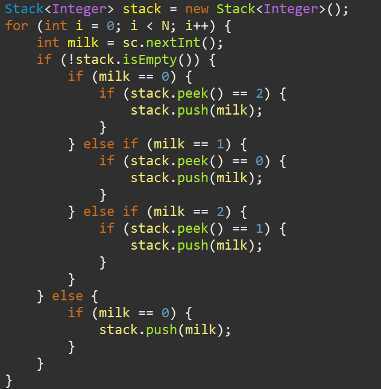

**문제**

영학이는 딸기우유, 초코우유, 바나나우유를 좋아한다.

입맛이 매우 까다로운 영학이는 자신만의 우유를 마시는 규칙이 있다.

맨 처음에는 딸기우유를 한 팩 마신다.

딸기우유를 한 팩 마신 후에는 초코우유를 한 팩 마신다.

초코우유를 한 팩 마신 후에는 바나나우유를 한 팩 마신다.

바나나우유를 한 팩 마신 후에는 딸기우유를 한 팩 마신다. 

영학이는 우유 축제가 열리고 있는 우유거리에 왔다. 우유 거리에는 우유 가게들이 일렬로 늘어서 있다.

영학이는 우유 거리의 시작부터 끝까지 걸으면서 우유를 사먹고자 한다.

각각의 우유 가게는 딸기, 초코, 바나나 중 한 종류의 우유만을 취급한다.

각각의 우유 가게 앞에서, 영학이는 우유를 사마시거나, 사마시지 않는다.

우유거리에는 사람이 많기 때문에 한 번 지나친 우유 가게에는 다시 갈 수 없다.

영학이가 마실 수 있는 우유의 최대 개수를 구하여라.

**입력**

첫째 줄에 우유 가게의 수 N이 주어진다. (1 ≤ N ≤ 1000)

둘째 줄에는 우유 가게 정보가 우유 거리의 시작부터 끝까지 순서대로 N개의 정수로 주어진다.

0은 딸기우유만을 파는 가게, 1은 초코우유만을 파는 가게, 2는 바나나우유만을 파는 가게를 뜻하며, 0, 1, 2 외의 정수는 주어지지 않는다.

**출력**

영학이가 마실 수 있는 우유의 최대 개수를 출력하시오.

**예제 입력 1** 

| 7 0 1 2 0 1 2 0 | 7    |
| --------------- | ---- |
|                 |      |

**출처**

[University](https://www.acmicpc.net/category/5) > [충남대학교](https://www.acmicpc.net/category/402) > [생각하는 프로그래밍 대회 ](https://www.acmicpc.net/category/detail/1756) E번

**문제 풀이**

이 문제는 무조건 순서가 정해져있는 문제기 때문에 순차적으로 0-1-2를 찾도록 구현해주면 된다.

맨 위값이 계속 바뀌어야 하기 때문에 stack.peek()을 이용해서 넣을때마다 다음 값을 찾기 쉽도록 구현했다.

최종적으로 stack에 담겨진 개수만 체크하면 된다.


**1**

stack을 이용해서 우유의 순서를 push해줬고, 순서가 있기 때문에 무조건 시작부터 체크하면 가장 많은 값을 찾을 수 있다.



> 알고리즘 : 그리디(Greedy)
>
> GitHub : https://github.com/shinsung3

https://github.com/shinsung3/Algorithm-BOJ-/blob/master/com.algorithm.java/src/Bronze3/Main_14720.java

[](https://github.com/shinsung3/Algorithm-BOJ-/blob/master/com.algorithm.java/src/Bronze3/Main_14720.java)[**Algorithm-BOJ-/Main_14720.java at master · shinsung3/Algorithm-BOJ-**백준 알고리즘 문제풀이. Contribute to shinsung3/Algorithm-BOJ- development by creating an account on GitHub.github.com](https://github.com/shinsung3/Algorithm-BOJ-/blob/master/com.algorithm.java/src/Bronze3/Main_14720.java)

**전체 소스코드** 

```java
package Bronze3;

import java.util.Scanner;
import java.util.Stack;

public class Main_14720 {
	public static void main(String[] args) {
		Scanner sc = new Scanner(System.in);
//		sc = new Scanner(src);
		int N = sc.nextInt();
//		맨 처음에는 딸기우유를 한 팩 마신다.
//		딸기우유를 한 팩 마신 후에는 초코우유를 한 팩 마신다.
//		초코우유를 한 팩 마신 후에는 바나나우유를 한 팩 마신다.
//		바나나우유를 한 팩 마신 후에는 딸기우유를 한 팩 마신다. 
//		0은 딸기우유만을 파는 가게, 1은 초코우유만을 파는 가게, 2는 바나나우유만을 파는 가게
		Stack<Integer> stack = new Stack<Integer>();
		for (int i = 0; i < N; i++) {
			int milk = sc.nextInt();
			if (!stack.isEmpty()) {
				if (milk == 0) {
					if (stack.peek() == 2) {
						stack.push(milk);
					}
				} else if (milk == 1) {
					if (stack.peek() == 0) {
						stack.push(milk);
					}
				} else if (milk == 2) {
					if (stack.peek() == 1) {
						stack.push(milk);
					}
				}
			} else {
				if (milk == 0) {
					stack.push(milk);
				}
			}
		}
		System.out.println(stack.size());
	}

	private static String src = "7\r\n" + "0 1 2 0 1 2 0";
}
```

