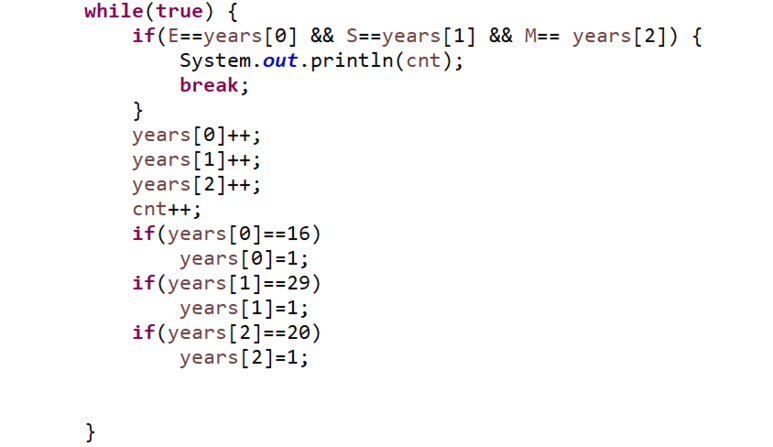
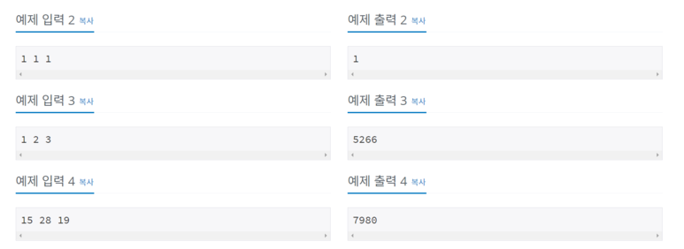

**문제**

준규가 사는 나라는 우리가 사용하는 연도와 다른 방식을 이용한다. 준규가 사는 나라에서는 수 3개를 이용해서 연도를 나타낸다. 각각의 수는 지구, 태양, 그리고 달을 나타낸다.

지구를 나타내는 수를 E, 태양을 나타내는 수를 S, 달을 나타내는 수를 M이라고 했을 때, 이 세 수는 서로 다른 범위를 가진다. (1 ≤ E ≤ 15, 1 ≤ S ≤ 28, 1 ≤ M ≤ 19)

우리가 알고있는 1년은 준규가 살고있는 나라에서는 1 1 1로 나타낼 수 있다. 1년이 지날 때마다, 세 수는 모두 1씩 증가한다. 만약, 어떤 수가 범위를 넘어가는 경우에는 1이 된다.

예를 들어, 15년은 15 15 15로 나타낼 수 있다. 하지만, 1년이 지나서 16년이 되면 16 16 16이 아니라 1 16 16이 된다. 이유는 1 ≤ E ≤ 15 라서 범위를 넘어가기 때문이다.

E, S, M이 주어졌고, 1년이 준규가 사는 나라에서 1 1 1일때, 준규가 사는 나라에서 E S M이 우리가 알고 있는 연도로 몇 년인지 구하는 프로그램을 작성하시오.

**문제풀이**

흠... 너무 간단하게 count해주면 되는 문제..

어렵게 생각하지 말자!

너무 간단한 count..;;



https://github.com/shinsung3/Algorithm-BOJ-/blob/master/Main_1476.java

[](https://github.com/shinsung3/Algorithm-BOJ-/blob/master/Main_1476.java)[ **shinsung3/Algorithm-BOJ-**백준 알고리즘 문제풀이. Contribute to shinsung3/Algorithm-BOJ- development by creating an account on GitHub.github.com](https://github.com/shinsung3/Algorithm-BOJ-/blob/master/Main_1476.java)

**입력**

첫째 줄에 세 수 E, S, M이 주어진다. 문제에 나와있는 범위를 지키는 입력만 주어진다.

**출력**

첫째 줄에 E S M으로 표시되는 가장 빠른 연도를 출력한다. 1 1 1은 항상 1이기 때문에, 정답이 음수가 나오는 경우는 없다.

**예제 입력 1** 

1 16 16 

**예제 출력 1** 

16 



**소스코드** 

```java
import java.util.Scanner;

public class Main {

	public static void main(String[] args) {
		Scanner sc = new Scanner(System.in);
//		sc = new Scanner(src);
		
		int E = sc.nextInt();
		int S = sc.nextInt();
		int M = sc.nextInt();
		
		int years[] = new int[3];
		for(int i=0; i<3; i++) {
			years[i] = 1;
		}
		int cnt=1;
		while(true) {
			if(E==years[0] && S==years[1] && M== years[2]) {
				System.out.println(cnt);
				break;
			}
			years[0]++;
			years[1]++;
			years[2]++;
			cnt++;
			if(years[0]==16)
				years[0]=1;
			if(years[1]==29)
				years[1]=1;
			if(years[2]==20)
				years[2]=1;
			
			
		}
	}

	private static String src = "1 16 16";
}
```

