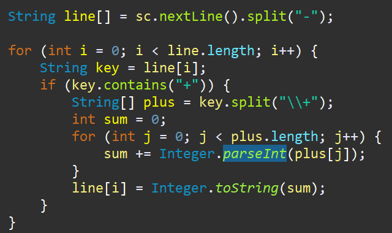
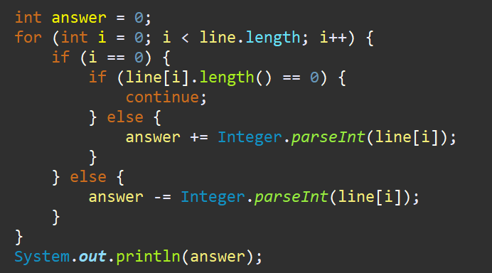

**문제**

세준이는 양수와 +, -, 그리고 괄호를 가지고 식을 만들었다. 그리고 나서 세준이는 괄호를 모두 지웠다.

그리고 나서 세준이는 괄호를 적절히 쳐서 이 식의 값을 최소로 만들려고 한다.

괄호를 적절히 쳐서 이 식의 값을 최소로 만드는 프로그램을 작성하시오.

**입력**

첫째 줄에 식이 주어진다. 식은 ‘0’~‘9’, ‘+’, 그리고 ‘-’만으로 이루어져 있고, 가장 처음과 마지막 문자는 숫자이다. 그리고 연속해서 두 개 이상의 연산자가 나타나지 않고, 5자리보다 많이 연속되는 숫자는 없다. 수는 0으로 시작할 수 있다. 입력으로 주어지는 식의 길이는 50보다 작거나 같다.

**출력**

첫째 줄에 정답을 출력한다.

**입/출력**

| 입력     | 출력 |
| -------- | ---- |
| 55-50+40 | -35  |

**문제 풀이**

처음에 이 문제를 풀 때는 **순열**을 구현해서 짜야된다고 생각했는데, 순서가 중요한게 아니었다.

가장 중요한 목적은 **"마이너스"** 지점을 찾는 것!

마이너스를 기준으로 값을 쪼개서 나머지는 다 더하고 나머지는 전부 빼주면 된다.


**1**

**"-"를 기준으로 split("-")을 해준다.**

이후, "+"가 포함되어져 있으면 모든 값을 더해서 다시 String[] 배열에 넣어준다.

예를 들어 -45 + 60 + 12 + 43 - 21 + 34 + 50

이라면 ! [-, 45+60+12+43, -, 21+34+50]

==================> ["", 160,  105] 로 마이너스가 아닐 때는 모두 더해지는 구조로 구현한다.



****

**2**

쪼개진 배열에 따라서 값을 빼주면서 누적해주면 된다.

혹시라도 시작부터 -였다면 빼주고, 아니라면 더해준 상태로 시작한다.



https://github.com/shinsung3/Algorithm-BOJ-/blob/master/com.algorithm.java/src/Silver2/Main_1541.java

[](https://github.com/shinsung3/Algorithm-BOJ-/blob/master/com.algorithm.java/src/Silver2/Main_1541.java)[**Algorithm-BOJ-/Main_1541.java at master · shinsung3/Algorithm-BOJ-**백준 알고리즘 문제풀이. Contribute to shinsung3/Algorithm-BOJ- development by creating an account on GitHub.github.com](https://github.com/shinsung3/Algorithm-BOJ-/blob/master/com.algorithm.java/src/Silver2/Main_1541.java)

> 알고리즘 : #split #Integer #parseInt
>
> GitHub : https://github.com/shinsung3

**전체 소스코드** 

```java
package Silver2;

import java.util.Scanner;

public class Main_1541 {
	public static void main(String[] args) {
		Scanner sc = new Scanner(System.in);
//		sc = new Scanner(src);

		String line[] = sc.nextLine().split("-");

		for (int i = 0; i < line.length; i++) {
			String key = line[i];
			if (key.contains("+")) {
				String[] plus = key.split("\\+");
				int sum = 0;
				for (int j = 0; j < plus.length; j++) {
					sum += Integer.parseInt(plus[j]);
				}
				line[i] = Integer.toString(sum);
			}
		}

		int answer = 0;
		for (int i = 0; i < line.length; i++) {
			if (i == 0) {
				if (line[i].length() == 0) {
					continue;
				} else {
					answer += Integer.parseInt(line[i]);
				}
			} else {
				answer -= Integer.parseInt(line[i]);
			}
		}
		System.out.println(answer);

	}

	private static String src = "55-50+40";
}
```

