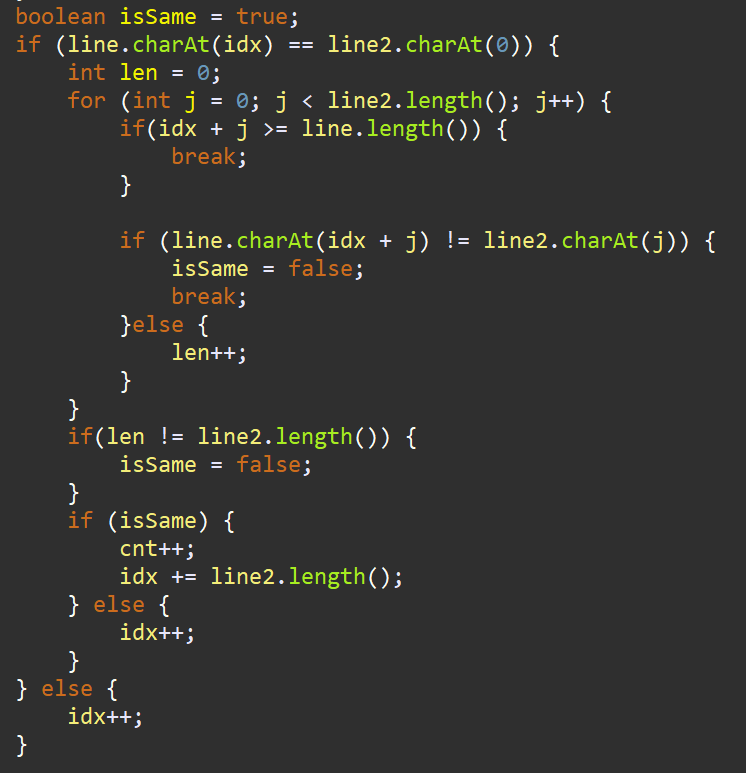

**문제**

세준이는 영어로만 이루어진 어떤 문서를 검색하는 함수를 만들려고 한다. 이 함수는 어떤 단어가 총 몇 번 등장하는지 세려고 한다. 그러나, 세준이의 함수는 중복되어 세는 것은 빼고 세야 한다. 예를 들어, 문서가 abababa이고, 그리고 찾으려는 단어가 ababa라면, 세준이의 이 함수는 이 단어를 0번부터 찾을 수 있고, 2번부터도 찾을 수 있다. 그러나 동시에 셀 수는 없다.

세준이는 문서와 검색하려는 단어가 주어졌을 때, 그 단어가 최대 몇 번 중복되지 않게 등장하는지 구하는 프로그램을 작성하시오.

**입력**

첫째 줄에 문서가 주어진다. 문서의 길이는 최대 2500이다. 둘째 줄에 검색하고 싶은 단어가 주어진다. 이 길이는 최대 50이다. 문서와 단어는 알파벳 소문자와 공백으로 이루어져 있다.

**출력**

첫째 줄에 중복되지 않게 최대 몇 번 등장하는지 출력한다.

**예제 입출력**

| ababababa aba   | 2    |
| --------------- | ---- |
| a a a a a a a   | 2    |
| ababababa ababa | 1    |
| aaaaaaa aa      | 3    |

**문제 풀이**

이 문제는 문자열과 그리디 문제이다.

매칭되는 값이 나온 순간부터 매칭을 해가면 가장 많은 매칭수를 찾을 수 있다.


**1**

순차적으로 매칭값을 찾고, 모든 값이 맞아 떨어지나 찾기만 하면 된다.

***** **혹시나 마지막에 매칭의 개수가 딱 맞을지 틀릴지 알수 없으니 개수가 모두 맞는지 확인해야 한다.**



https://github.com/shinsung3/Algorithm-BOJ-/blob/master/com.algorithm.java/src/Silver4/Main_1543.java

[](https://github.com/shinsung3/Algorithm-BOJ-/blob/master/com.algorithm.java/src/Silver4/Main_1543.java)[**Algorithm-BOJ-/Main_1543.java at master · shinsung3/Algorithm-BOJ-**백준 알고리즘 문제풀이. Contribute to shinsung3/Algorithm-BOJ- development by creating an account on GitHub.github.com](https://github.com/shinsung3/Algorithm-BOJ-/blob/master/com.algorithm.java/src/Silver4/Main_1543.java)

> 알고리즘 : 그리디(greedy)
>
> GitHub : https://github.com/shinsung3

**전체 소스코드** 

```java
package Silver4;

import java.util.Scanner;

public class Main_1543 {
	public static void main(String[] args) {
		Scanner sc = new Scanner(System.in);
//		sc = new Scanner(src);
		String line = sc.nextLine();
		String line2 = sc.nextLine();

		int idx = 0;
		int cnt = 0;
		while (true) {
			if(idx>=line.length()) {
				break;
			}
			boolean isSame = true;
			if (line.charAt(idx) == line2.charAt(0)) {
				int len = 0;
				for (int j = 0; j < line2.length(); j++) {
					if(idx + j >= line.length()) {
						break;
					}
					
					if (line.charAt(idx + j) != line2.charAt(j)) {
						isSame = false;
						break;
					}else {
						len++;
					}
				}
				if(len != line2.length()) {
					isSame = false;
				}
				if (isSame) {
					cnt++;
					idx += line2.length();
				} else {
					idx++;
				}
			} else {
				idx++;
			}
		}
		System.out.println(cnt);
	}

	static String src = "ababababa\r\n" + "ababa";
}
```

