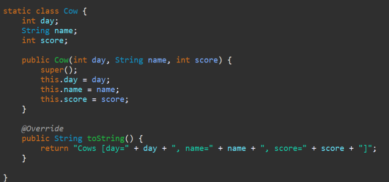
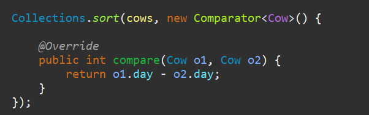
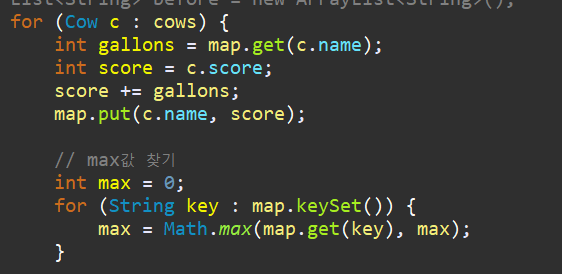
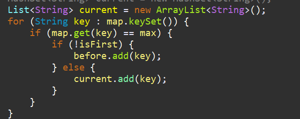
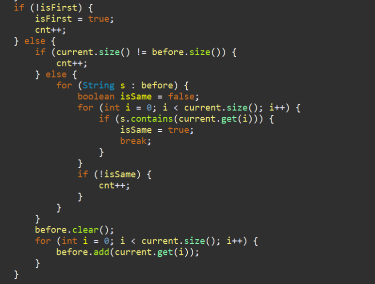

**문제**

Farmer John purchases three cows: Bessie, Elsie, and Mildred, each of whom initially produces 7 gallons of milk per day. Since the milk output of a cow is known to potentially change over time, Farmer John takes periodic measurements over the next 100 days and scribbles them down in a log book. Entries in his log look like this:

35 Bessie -2 14 Mildred +3 

The first entry indicates that on day 35, Bessie's milk output was 2 gallons lower than it was when last measured. The next entry indicates that on day 14, Mildred's milk output increased by 3 gallons from when it was last measured. Farmer John has only enough time to make at most one measurement on any given day. Unfortunately, he is a bit disorganized, and doesn't necessarily write down his measurements in chronological order.

To keep his cows motivated, Farmer John proudly displays on the wall of his barn the picture of whichever cow currently has the highest milk output (if several cows tie for the highest milk output, he displays all of their pictures). Please determine the number of days on which Farmer John would have needed to change this display.

**입력**

The first line of input contains N, the number of measurements Farmer John makes. Each of the next 

N lines contains one measurement, in the format above, specifying a day (an integer in the range 1..100), the name of a cow, and the change in her milk output since it was last measured (a nonzero integer). Each cow's milk output will always be in the range 0..1000.

**출력**

Please output the number of days (an integer in the range 0..100) on which Farmer John needs to adjust his motivational display.

**예제** 

| 4 7 Mildred +3 4 Elsie -1 9 Mildred -1 1 Bessie +2 | 3    |
| -------------------------------------------------- | ---- |
|                                                    |      |

**힌트**

Initially, all cows have milk output 7. On day 1, Bessie's milk output increases to 9, making her the unique cow with highest milk output and causing Farmer John to change his display. On day 4, Elsie's milk output decreases to 6, but this does not change the fact that Bessie is the sole cow in the lead. On day 7, Mildred jumps into the lead, changing the display, and on day 9, Mildred drops in production to be tied with Bessie, again changing the display.

**출처**

[Olympiad](https://www.acmicpc.net/category/2) > [USA Computing Olympiad](https://www.acmicpc.net/category/106) > [2017-2018 Season](https://www.acmicpc.net/category/410) > [USACO 2017 December Contest](https://www.acmicpc.net/category/411) > [Bronze](https://www.acmicpc.net/category/detail/1835) 3번

**문제풀이**

대부분의 USACO 문제는 영어를 번역하는 것도 어렵지만 무슨 농부가 자꾸 소를 어떻게 한다는 내용이 많아서 더 어려운 것 같다. 또 단위를 gallons 이런걸로 써버리면 읽다가도 머리가 아프다.

문제 유형은 비슷한 듯 하면서도 본인들만의 유형이 따로 있더라 그래서 USACO 알고리즘은 좀 다방면으로 공부를 해야한다.

*이 문제는 소가 우유를 짤때마다 바뀌는 우유의 양을 체크하고, max양의 우유를 짠 소의 사진을 걸어줄 것인데, 총 몇번의 사진이 바뀔 것이냐 묻는것이다.*


1

소와 날짜와 변화되는 양을 저장해주기 위해서 따로 class를 생성했다.



2

날짜순으로 사진을 바꿔달아야 하기 때문에 정렬을 먼저 해준다.



3

변화가 있는 날마다 소의 max 우유양을 구해준다.



4

소의 양이 before(과거)와 current(현재) 어떻게 달라졌는지를 체크하기 위해 max양이 되는 친구들은 current List에 담아준다. 만약에 아직 한번도 변화가 없었다면 isFirst 를 통해서 before에 값을 넣어준다.



5

처음 데이터가 들어갔다면(=사진이 처음 걸렸다면) cnt를 증가시켜주고, 만약 현재와 과거 사진의 개수가 다르다면 체크해볼 필요도 없이 cnt를 증가시켜준다. 같다면 같은 소인지 아닌지 체크해준다.

그리고 다시 before에 current소의 데이터를 넣어준다.



**전체 소스코드**

```java
package Silver2;

import java.util.ArrayList;
import java.util.Collections;
import java.util.Comparator;
import java.util.HashMap;
import java.util.HashSet;
import java.util.LinkedList;
import java.util.List;
import java.util.Scanner;

public class Main_15465 {
	public static void main(String[] args) {
//		1. Farmer John purchases three cows: Bessie, Elsie, and Mildred
		Scanner sc = new Scanner(System.in);
//		sc = new Scanner(src);
		int N = sc.nextInt();
		List<Cow> cows = new LinkedList<>();
		sc.nextLine();
		for (int i = 0; i < N; i++) {
			String line = sc.nextLine();
			String[] str = line.split(" ");
			cows.add(new Cow(Integer.parseInt(str[0]), str[1], Integer.parseInt(str[2])));
		}

		Collections.sort(cows, new Comparator<Cow>() {

			@Override
			public int compare(Cow o1, Cow o2) {
				return o1.day - o2.day;
			}
		});

//		2. each of whom initially produces 7 gallons of milk per day.
		HashMap<String, Integer> map = new HashMap<String, Integer>();
		map.put("Bessie", 7);
		map.put("Elsie", 7);
		map.put("Mildred", 7);
		boolean isFirst = false;
		int cnt = 0;
		HashSet<String> before = new HashSet<String>();
//		List<String> before = new ArrayList<String>();
		for (Cow c : cows) {
			int gallons = map.get(c.name);
			int score = c.score;
			score += gallons;
			map.put(c.name, score);

			// max값 찾기
			int max = 0;
			for (String key : map.keySet()) {
				max = Math.max(map.get(key), max);
			}

			// display할 주인공 찾기 여러개면 여러명.
//			HashSet<String> current = new HashSet<String>();
			List<String> current = new ArrayList<String>();
			for (String key : map.keySet()) {
				if (map.get(key) == max) {
					if (!isFirst) {
						before.add(key);
					} else {
						current.add(key);
					}
				}
			}
			if (!isFirst) {
				isFirst = true;
				cnt++;
			} else {
				if (current.size() != before.size()) {
					cnt++;
				} else {
					for (String s : before) {
						boolean isSame = false;
						for (int i = 0; i < current.size(); i++) {
							if (s.contains(current.get(i))) {
								isSame = true;
								break;
							}
						}
						if (!isSame) {
							cnt++;
						}
					}
				}
				before.clear();
				for (int i = 0; i < current.size(); i++) {
					before.add(current.get(i));
				}
			}
		}
//		System.out.println(cows);
		System.out.println(cnt);
	}

	static class Cow {
		int day;
		String name;
		int score;

		public Cow(int day, String name, int score) {
			super();
			this.day = day;
			this.name = name;
			this.score = score;
		}

		@Override
		public String toString() {
			return "Cows [day=" + day + ", name=" + name + ", score=" + score + "]";
		}

	}

	private static String src = "4\r\n" + "7 Mildred +3\r\n" + "4 Elsie -1\r\n" + "9 Mildred -1\r\n" + "1 Bessie +2";
}
```

