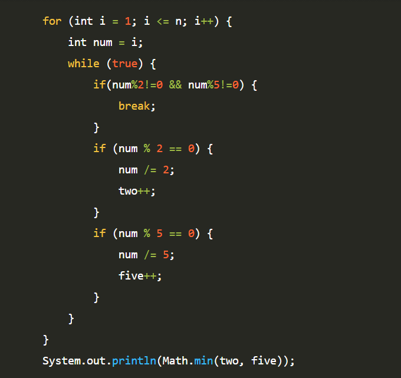

**문제**

N!에서 뒤에서부터 처음 0이 아닌 숫자가 나올 때까지 0의 개수를 구하는 프로그램을 작성하시오.

**입력**

첫째 줄에 N이 주어진다. (0 ≤ N ≤ 500)

**출력**

첫째 줄에 구한 0의 개수를 출력한다.

**예제 입력 / 출력**

| 10   | 2    |
| ---- | ---- |
| 3    | 0    |

**문제 풀이**

이런 수학 문제는 우선 500팩토리얼까지 구해보고 **아! 뭔가 틀렸구나!******를 느낀 다음에 다시 고민하는 시간만 30분을 하게 되는 문제다.


**1**

이미 팩토리얼은 60!이 넘어가면서부터 값을 구할수가 없다.

그러니 500!은 구할 수 없다는 걸 알아야 한다.

그래서 어떻게 하면 0이 들어올까를 고민하다가 10의 배수가 들어오면 끝에 0이 생긴다는 걸 -> 정말 정말 오래 고민하다가 발견했다!!

**유레카!!** 를 외치며 코드를 짰는데, 10이 들어왔을 때, 10은 2*5 가 아니다!

결과적으로 코드는 10이 들어오면 1* 2* 3* 4* 5* 6* 7* 8* 9 * 10 <<이 되어야 하기 때문에 모든 곱에서 10의 개수를 찾아내야 한다. 2*5가 몇개있는지 찾아내면 값을 구할 수 있다!



> 알고리즘 : 수학
>
> GitHub : https://github.com/shinsung3

https://github.com/shinsung3/Algorithm-BOJ-/blob/master/Main_1676.java

[](https://github.com/shinsung3/Algorithm-BOJ-/blob/master/Main_1676.java)[**Algorithm-BOJ-/Main_1676.java at master · shinsung3/Algorithm-BOJ-**백준 알고리즘 문제풀이. Contribute to shinsung3/Algorithm-BOJ- development by creating an account on GitHub.github.com](https://github.com/shinsung3/Algorithm-BOJ-/blob/master/Main_1676.java)

**전체 소스코드** 

```java
import java.util.Scanner;

public class Main_1676 {
	public static void main(String[] args) {
		Scanner sc = new Scanner(System.in);
//		sc = new Scanner(src);
		int n = sc.nextInt();
		int two = 0;
		int five = 0;
		
		for (int i = 1; i <= n; i++) {
			int num = i;
			while (true) {
				if(num%2!=0 && num%5!=0) {
					break;
				}
				if (num % 2 == 0) {
					num /= 2;
					two++;
				}
				if (num % 5 == 0) {
					num /= 5;
					five++;
				}	
			}
		}
		System.out.println(Math.min(two, five));

	}

	private static String src = "10";
}
```

