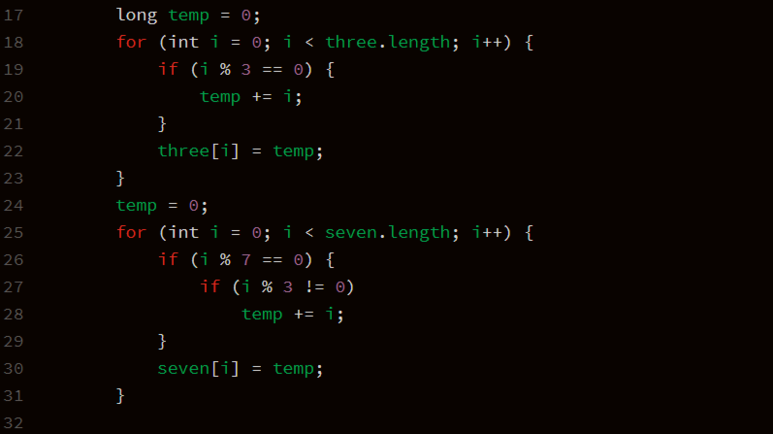

**문제**

준석이의 수학선생님은 간단한 수학 문제를 숙제로 내셨다. 그 문제는 어떤 자연수 N이 주어지면 N 이하의 3 또는 7의 양의 배수를 모두 더한 값을 구하는 문제다. 그러나 숫자를 손가락과 발가락으로 밖에 셀 줄 모르는 준석이는 N이 커지자 문제를 풀지 못했다. 준석이를 위해 우리가 정답을 구해주자. 문제는 중복될 수 있다.

**문제풀이**

**1**

런타임 에러가 되지 않도록! long 적용

**2**

메모리 초과를 대비해서 미리 DP알고리즘을 활용해서 누적시킴.

**3**

결과값만 찾으면 된다!



**입력**

첫째 줄에는 문제의 수를 나타내는 T가 주어진다 (1 ≤ T ≤ 100,000)

그 다음 줄에 빈 칸으로 구분하여 T개의 자연수 N이 주어진다. (10 ≤ N ≤ 80,000)

**출력**

각 문제마다 답을 출력한다. 출력은 개행으로 구분한다.

**예제 입력 1** 

2 10 21 

**예제 출력 1** 

25 105 

10 이하의 3 또는 7의 배수는 3, 6, 7, 9가 있다.

21 이하의 3 또는 7의 배수는 3, 6, 7, 9, 12, 14, 15, 18, 21이 있다.

**소스코드**

```java
import java.util.Scanner;

public class Main {

	public static void main(String[] args) {
		Scanner sc = new Scanner(System.in);
//		sc = new Scanner(src);
		int N = sc.nextInt();
		int n[] = new int[N];
		for (int i = 0; i < N; i++) {
			n[i] = sc.nextInt();
		}

		long[] three = new long[80001];
		long[] seven = new long[80001];

		long temp = 0;
		for (int i = 0; i < three.length; i++) {
			if (i % 3 == 0) {
				temp += i;
			}
			three[i] = temp;
		}
		temp = 0;
		for (int i = 0; i < seven.length; i++) {
			if (i % 7 == 0) {
				if (i % 3 != 0)
					temp += i;
			}
			seven[i] = temp;
		}

		for (int i = 0; i < N; i++) {
			long sum = seven[n[i]] + three[n[i]];
			System.out.println(sum);
		}
	}

	private static String src = "2\r\n" + "10 21";
}
```

