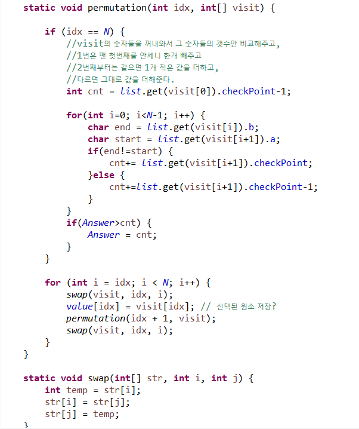

**문제**

선린 친구들은 ✨**인기스타** **슈퍼인싸** **예원쌤**✨을 존경한다. 방학 동안 선생님을 뵐 수 없다니! 그래서 학생들은 방학식 날 💡**전구 길만 걷자**💡라는 엄청난 이벤트를 준비했다.

💡💡💡💡👨‍🏫💡💡💡💡

아무도 몰랐지만, 사실 선린의 과학실에는 전구가 일렬로 이어진 전구 묶음이 N개 있다. 학생들은 이 묶음을 일렬로 이어 전구 길을 만들기로 했다. 하지만 묶음에는 불이 들어오지 않는 전구가 섞여 있었는데, 전구들을 일렬로 이어 놓으니 켜진 전구와 꺼진 전구가 번갈아 나타나서 전구 길이 예쁘지 않았다.

그래서 학생들은 전구 길이 최대한 예쁘도록 묶음을 배열하려고 한다. 전구 길은 **전구 상태가 바뀌는 횟수가 최소일 때** 가장 예쁘다고 한다. 이는 켜진 전구를 1, 꺼진 전구를 0이라 했을 때, 전구 길에 01 또는 10이 최소로 나타나야 한다는 의미이다.

예를 들어, (1011) 묶음과 (1000) 묶음을 이어 붙여야 한다고 하자. 이때는 (10111000) 순서로 잇는 것이 (10001011) 순서로 잇는 것보다 예쁘다. 전자는 전구의 상태가 3번 바뀌고, 후자는 전구의 상태가 4번 바뀌기 때문이다.

그런데 갑자기 세한이가 코드를 작성해서 이를 계산하자고 한다.

세한이와 함께 전구 길을 예쁘게 꾸며보자!

**문제풀이**

**1**

100 ^10승이기 때문에 순열로 돌린 뒤에 반복적으로 for문으로 탐색을 하면 **터진다.**

**2**

터지지 않도록 하기 위해서는 미리 변화되는 갯수를 기억해놓고, **class에 저장해서 List를 들고 다니면서**

**간단히 숫자만 계산해주면 틀리지 않는다!**

****

**<순열짜는법>**




https://github.com/shinsung3/Algorithm-BOJ-/blob/master/Main_17359.java

[](https://github.com/shinsung3/Algorithm-BOJ-/blob/master/Main_17359.java)[ **shinsung3/Algorithm-BOJ-**백준 알고리즘 문제풀이. Contribute to shinsung3/Algorithm-BOJ- development by creating an account on GitHub.github.com](https://github.com/shinsung3/Algorithm-BOJ-/blob/master/Main_17359.java)

**입력**

첫째 줄에 전구 묶음의 개수 N이 주어진다. (1 ≤ N ≤ 10)

둘째 줄부터 N개의 줄에 걸쳐, 각 줄마다 전구 묶음의 상태를 나타내는 문자열이 주어진다. 문자열은 0 또는 1로만 이루어져 있으며 0은 꺼진 전구를, 1은 켜진 전구를 의미한다.

문자열의 길이는 1 이상 100 이하이다.

**출력**

전구 묶음을 가장 예쁘게 배치했을 때, 전구의 상태가 바뀌는 횟수를 출력한다.

**예제 입력 1** 

3 11100 0000101 011100 

**예제 출력 1** 

6 

**예제 입력 2** 

4 00 01 10 11 

**예제 출력 2** 

2

**소스코드** 

```java
import java.util.ArrayList;
import java.util.Arrays;
import java.util.List;
import java.util.Scanner;

public class Main {
	static int N;

	public static void main(String[] args) {
		Scanner sc = new Scanner(System.in);
//		sc = new Scanner(src);
		N = sc.nextInt();
		sc.nextLine();

		list = new ArrayList<>();
		value = new int[N];
		String[] str = new String[N];
		for (int i = 0; i < N; i++) {
			str[i] = sc.nextLine(); //문자열 배열에 먼저 입력값을 받아준다.
			
			int cnt = 1;

			char ch = str[i].charAt(0); //문자열의 길이가 최대 100이므로 터질수도 있어서
			//미리 문자열에 변화가 몇번 있는지 세준다.
			for(int j=0; j<str[i].length(); j++) {
				if(ch!=str[i].charAt(j)) {
					cnt++;
					ch = str[i].charAt(j);
				}
			}
			
			//리스트에 시작과 끝, 문자열의 마지막을 저장하고, 변화의 갯수를 저장
			list.add(new Node(str[i].charAt(0), str[i].charAt(str[i].length()-1),cnt));
		}
		
		int visit[] = new int[N];
		for(int i=0; i<N; i++) {
			visit[i] = i;
		}

		permutation(0, visit);
		System.out.println(Answer);
	}

	static int[] value;
	static int Answer = Integer.MAX_VALUE;
	static ArrayList<Node> list;

	static void permutation(int idx, int[] visit) {

		if (idx == N) {
			//visit의 숫자들을 꺼내와서 그 숫자들의 갯수만 비교해주고,
			//1번은 맨 첫번째를 안세니 한개 빼주고
			//2번째부터는 같으면 1개 적은 값을 더하고,
			//다르면 그대로 값을 더해준다.
			int cnt = list.get(visit[0]).checkPoint-1;
			
			for(int i=0; i<N-1; i++) {
				char end = list.get(visit[i]).b;
				char start = list.get(visit[i+1]).a;
				if(end!=start) {
					cnt+= list.get(visit[i+1]).checkPoint;
				}else {
					cnt+=list.get(visit[i+1]).checkPoint-1;
				}
			}
			if(Answer>cnt) {
				Answer = cnt;
			}
		}

		for (int i = idx; i < N; i++) {
			swap(visit, idx, i);
			value[idx] = visit[idx]; // 선택된 원소 저장?
			permutation(idx + 1, visit);
			swap(visit, idx, i);
		}
	}
	
	static class Node{
		char a, b;
		int checkPoint;
		public Node(char a, char b, int checkPoint) {
			super();
			this.a = a;
			this.b = b;
			this.checkPoint = checkPoint;
		}
		@Override
		public String toString() {
			return "Node [a=" + a + ", b=" + b + ", checkPoint=" + checkPoint + "]";
		}
	}

	static void swap(int[] str, int i, int j) {
		int temp = str[i];
		str[i] = str[j];
		str[j] = temp;
	}

	private static String src = "3\r\n" + "11100\r\n" + "0000101\r\n" + "011100";
}
```

