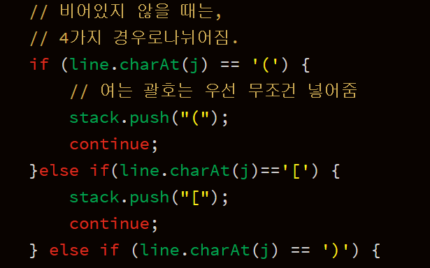

**문제**

4개의 기호 ‘(’, ‘)’, ‘[’, ‘]’를 이용해서 만들어지는 괄호열 중에서 올바른 괄호열이란 다음과 같이 정의된다.

한 쌍의 괄호로만 이루어진 ‘()’와 ‘[]’는 올바른 괄호열이다. 

만일 X가 올바른 괄호열이면 ‘(X)’이나 ‘[X]’도 모두 올바른 괄호열이 된다. 

X와 Y 모두 올바른 괄호열이라면 이들을 결합한 XY도 올바른 괄호열이 된다.

예를 들어 ‘(()[[]])’나 ‘(())[][]’ 는 올바른 괄호열이지만 ‘([)]’ 나 ‘(()()[]’ 은 모두 올바른 괄호열이 아니다. 우리는 어떤 올바른 괄호열 X에 대하여 그 괄호열의 값(괄호값)을 아래와 같이 정의하고 값(X)로 표시한다. 

‘()’ 인 괄호열의 값은 2이다.

‘[]’ 인 괄호열의 값은 3이다.

‘(X)’ 의 괄호값은 2×값(X) 으로 계산된다.

‘[X]’ 의 괄호값은 3×값(X) 으로 계산된다.

올바른 괄호열 X와 Y가 결합된 XY의 괄호값은 값(XY)= 값(X)+값(Y) 로 계산된다.

예를 들어 ‘(()[[]])([])’ 의 괄호값을 구해보자.  ‘()[[]]’ 의 괄호값이 2 + 3×3=11 이므로  ‘(()[[ ]])’의 괄호값은 2×11=22 이다. 그리고  ‘([])’의 값은 2×3=6 이므로 전체 괄호열의 값은 22 + 6 = 28 이다.

여러분이 풀어야 할 문제는 주어진 괄호열을 읽고 그 괄호값을 앞에서 정의한대로 계산하여 출력하는 것이다. 

**문제풀이**

이 문제는 어떻게 풀까 고민을 좀 많이했던건 사실이다.

원래 스택으로 괄호문제를 풀때 열린 괄호만 넣어주고 닫힌 괄호를 만나면 빼준다!

라는 생각만 했었는데...

이 문제에서는 생성된 값을 바로바로 스택에 넣어서 저장한다


(..너무 못짜서 올릴까 말까 고민했지만.. 그래도 이런 무작정인 방법이 있다는 것도 ..)


**1**

스택이 비어있다면 바로 괄호를 넣는다.


**2**

스택이 비어있지 않을 때는 4가지 경우의 수로 나누어서 생각한다.




****

**입력**

첫째 줄에 괄호열을 나타내는 문자열(스트링)이 주어진다. 단 그 길이는 1 이상, 30 이하이다.

**출력**

첫째 줄에 그 괄호열의 값을 나타내는 정수를 출력한다. 만일 입력이 올바르지 못한 괄호열이면 반드시 0을 출력해야 한다. 

**예제 입력 1** 

(()[[]])([])

**예제 출력 1** 

28

****

**소스코드

```java
import java.util.ArrayList;
import java.util.Arrays;
import java.util.LinkedList;
import java.util.List;
import java.util.Queue;
import java.util.Scanner;
import java.util.Stack;

public class Main {

	public static void main(String[] args) {
		Scanner sc = new Scanner(System.in);
//		sc = new Scanner(src);
		Stack<String> stack = new Stack<String>();
		int result = 0;
		String line = sc.next();
		out: for (int j = 0; j < line.length(); j++) {
			if (stack.isEmpty()) {
				// 스택이 비면 무조건 넣어주기.
				if (line.charAt(j) == '(')
					stack.push("(");
				else if(line.charAt(j)=='[') {
					stack.push("[");
				}
				else {
					// 잘 못 되면 멈추고 브레이크.
					result = 0;
					break out;
				}

			} else {
				// 비어있지 않을 때는,
				// 4가지 경우로나뉘어짐.
				if (line.charAt(j) == '(') {
					// 여는 괄호는 우선 무조건 넣어줌
					stack.push("(");
					continue;
				}else if(line.charAt(j)=='[') {
					stack.push("[");
					continue;
				} else if (line.charAt(j) == ')') {
					if(stack.isEmpty())
					{
						result=0;
						break out;
					}
					// 닫는 소괄호가 오면 stack에 젤 위에 있는 걸 확인.
					if (stack.peek() == "(") {
						// 바로 괄호 완성 되면
						stack.pop();
						stack.push("2");
						continue;
					} else if (stack.peek() == "[") {
						// 맞지 않는 괄호가 오면
						result = 0;
						break out;
					} else {
						int tmp = Integer.parseInt(stack.pop());
						if(stack.isEmpty())
						{
							result=0;
							break out;
						}
						if(stack.peek()!="[" && stack.peek()!="(") {
							while(true) {
								if(stack.isEmpty()) {
									result = 0;
									break out;
								}
								if(stack.peek()=="[" || stack.peek()=="(") {
									if(stack.peek()=="[") {
										tmp=tmp*3;
										stack.pop();
										stack.push(Integer.toString(tmp));
									}
									else if(stack.peek()=="("){
										tmp=tmp*2;
										stack.pop();
										stack.push(Integer.toString(tmp));
									}
									break;
								}
								else
									tmp+=Integer.parseInt(stack.pop());
							}
							continue;
						}else if(stack.peek()=="("){
							tmp =tmp*2;
							stack.pop();
							stack.push(Integer.toString(tmp));
							continue;
						}else if(stack.peek()=="[") {
							result = 0;
							break out;
						}
					}
				} else if (line.charAt(j) == ']') {
					// 닫는 대괄호가 오면 stack에 젤 위에 있는거 확인!
					if(stack.isEmpty())
					{
						result=0;
						break out;
					}
					if (stack.peek() == "[") {
						// 바로 괄호 완성 되면
						stack.pop();
						stack.push("3");
						continue;
					} else if (stack.peek() == "(") {
						// 맞지 않는 괄호가 오면
						result = 0;
						break out;
					} else {
						// 그 외에 숫자들이 오면
						// 꺼내서 더해줍니다.
						int tmp = Integer.parseInt(stack.pop());
						if(stack.isEmpty())
						{
							result=0;
							break out;
						}
						if(stack.peek()!="[" && stack.peek()!="(") {
							while(true) {
								if(stack.isEmpty())
								{
									result=0;
									break;
								}
								if(stack.peek()=="[" || stack.peek()=="(") {
									if(stack.peek()=="[") {
										tmp=tmp*3;
										stack.pop();
										stack.push(Integer.toString(tmp));
									}
									else if(stack.peek()=="("){
										tmp=tmp*2;
										stack.pop();
										stack.push(Integer.toString(tmp));
									}
									break;
								}
								else
									tmp+=Integer.parseInt(stack.pop());
							}
							continue;
						}else if(stack.peek()=="["){
							tmp =tmp*3;
							stack.pop();
							stack.push(Integer.toString(tmp));
							continue;
						}else if(stack.peek()=="(") {
							result = 0;
							break out;
						}
					}
				}

			}
		}
		while(!stack.isEmpty()) {
			if(stack.peek()=="["||stack.peek()=="("||stack.peek()==")"||stack.peek()=="]") {
				
				result=0;
				break;
			}
			result+=Integer.parseInt(stack.pop());
		}
		System.out.println(result);
	}

	private static String src = "(()[[]])([])";

}
[출처] 백준(BOJ) 2504 - 괄호의 값 (단계별로 풀기 - 스택 사용하기 (기초)) // [java] - 런타임에러의 경우|작성자 누스타


```

