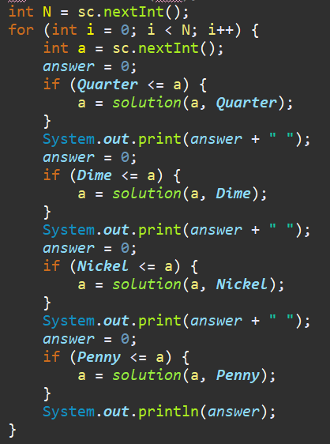
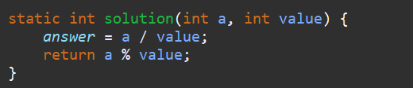

**문제**

미국으로 유학간 동혁이는 세탁소를 운영하고 있다. 동혁이는 최근에 아르바이트로 고등학생 리암을 채용했다.

동혁이는 리암에게 실망했다.

리암은 거스름돈을 주는 것을 자꾸 실수한다.

심지어 $0.5달러를 줘야하는 경우에 거스름돈으로 $5달러를 주는것이다!

어쩔수 없이 뛰어난 코딩 실력을 발휘해 리암을 도와주는 프로그램을 작성하려고 하지만, 디아블로를 하느라 코딩할 시간이 없어서 이 문제를 읽고 있는 여러분이 대신 해주어야 한다.

거스름돈의 액수가 주어지면 리암이 줘야할 쿼터(Quarter, $0.25)의 개수, 다임(Dime, $0.10)의 개수, 니켈(Nickel, $0.05)의 개수, 페니(Penny, $0.01)의 개수를 구하는 프로그램을 작성하시오. 거스름돈은 항상 $5.00 이하이고, 손님이 받는 동전의 개수를 최소로 하려고 한다. 예를 들어, $1.24를 거슬러 주어야 한다면, 손님은 4쿼터, 2다임, 0니켈, 4페니를 받게 된다.

**입력**

첫째 줄에 테스트 케이스의 개수 T가 주어진다. 각 테스트 케이스는 거스름돈 C를 나타내는 정수 하나로 이루어져 있다. C의 단위는 센트이다. (1달러 = 100센트) (1<=C<=500)

**출력**

각 테스트케이스에 대해 필요한 쿼터의 개수, 다임의 개수, 니켈의 개수, 페니의 개수를 공백으로 구분하여 출력한다.

**입출력**

| 3 124 25 194 | 4 2 0 4 1 0 0 0 7 1 1 4 |
| ------------ | ----------------------- |
|              |                         |

**출처**

[ICPC](https://www.acmicpc.net/category/1) > [Regionals](https://www.acmicpc.net/category/7) > [North America](https://www.acmicpc.net/category/8) > [Greater New York Region](https://www.acmicpc.net/category/9) > [2006 Greater New York Programming Contest](https://www.acmicpc.net/category/detail/10) A번

**문제 풀이**

저번 그리디 문제와 비슷한데, 그리디 알고리즘이란?

**그리디 알고리즘**(욕심쟁이 알고리즘, Greedy Algorithm)이란 "매 선택에서 **지금 이 순간 당장 최적인 답**을 선택하여 적합한 결과를 도출하자" 라는 모토를 가지는 [알고리즘](https://namu.wiki/w/알고리즘) 설계 기법이다.


**1**

거스름돈을 주는 방법같은 것은 언제나 최적을 찾기에 알맞는 문제라서 계속해서 그리디 알고리즘 문제로 나온다.

가장 큰 돈이 있을 때 가장 큰 동전을 거슬러줘서 동전 개수를 줄이는 것이다.



**2**

나누었을 때 몫은 동전의 개수가 되고, 나머지는 더 나눌 값이 있는지 확이하는 지표가 된다.



https://github.com/shinsung3/Algorithm-BOJ-/blob/master/com.algorithm.java/src/Bronze3/Main_2720_Greedy.java

[](https://github.com/shinsung3/Algorithm-BOJ-/blob/master/com.algorithm.java/src/Bronze3/Main_2720_Greedy.java)[**Algorithm-BOJ-/Main_2720_Greedy.java at master · shinsung3/Algorithm-BOJ-**백준 알고리즘 문제풀이. Contribute to shinsung3/Algorithm-BOJ- development by creating an account on GitHub.github.com](https://github.com/shinsung3/Algorithm-BOJ-/blob/master/com.algorithm.java/src/Bronze3/Main_2720_Greedy.java)

> 알고리즘 : Greedy(그리디 알고리즘)
>
> GitHub : https://github.com/shinsung3

**전체 소스코드** 

```java
package Bronze3;

import java.util.Scanner;

public class Main_2720_Greedy {

	static final int Quarter = 25;
	static final int Dime = 10;
	static final int Nickel = 5;
	static final int Penny = 1;

	public static void main(String[] args) {
		Scanner sc = new Scanner(System.in);
//		sc = new Scanner(src);
		int N = sc.nextInt();
		for (int i = 0; i < N; i++) {
			int a = sc.nextInt();
			answer = 0;
			if (Quarter <= a) {
				a = solution(a, Quarter);
			}
			System.out.print(answer + " ");
			answer = 0;
			if (Dime <= a) {
				a = solution(a, Dime);
			}
			System.out.print(answer + " ");
			answer = 0;
			if (Nickel <= a) {
				a = solution(a, Nickel);
			}
			System.out.print(answer + " ");
			answer = 0;
			if (Penny <= a) {
				a = solution(a, Penny);
			}
			System.out.println(answer);
		}
	}

	static int answer;

	static int solution(int a, int value) {
		answer = a / value;
		return a % value;
	}

	private static String src = "3\r\n" + "124\r\n" + "25\r\n" + "194";
}
```

