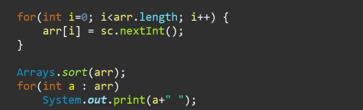

**문제**

동규는 세수를 하다가 정렬이 하고싶어졌다.

숫자 세 개를 생각한 뒤에, 이를 오름차순으로 정렬하고 싶어 졌다.

숫자 세 개가 주어졌을 때, 가장 작은 수, 그 다음 수, 가장 큰 수를 출력하는 프로그램을 작성하시오.

**입력**

숫자 세 개가 주어진다. 이 숫자는 1보다 크거나 같고, 1,000,000보다 작거나 같다. 이 숫자는 모두 다르다.

**출력**

제일 작은 수, 그 다음 수, 제일 큰 수를 차례대로 출력한다.

| 예제 입력 | 예제 출력 |
| --------- | --------- |
| 3 1 2     | 1 2 3     |

**문제 풀이**

Arrays.sort()에는 내부에 정렬되는 라이브러리가 있다. 이러한 라이브러리를 이용하여 정렬을 하면 해결할 수 있는 문제다.


**1**

입력을 Array형태로 입력 받고, Arrays.sort()를 활용하여 정렬한다. 마지막으로 ForEach문을 활용하여 답을 출력할 수 있다.



> 알고리즘 : 정렬 Arrays.sort()
>
> GitHub : https://github.com/shinsung3

**전체 소스코드** 

```java
//package com.algorithm.java;

import java.util.Arrays;
import java.util.Scanner;

public class Main_2752 {
	public static void main(String[] args) {
		Scanner sc = new Scanner(System.in);
//		sc = new Scanner(src);
		
		int[] arr = new int[3];
		
		for(int i=0; i<arr.length; i++) {
			arr[i] = sc.nextInt();
		}

		Arrays.sort(arr);
		for(int a : arr)
			System.out.print(a+" ");
	}

//	private static String src = "3 1 2";
}
```

