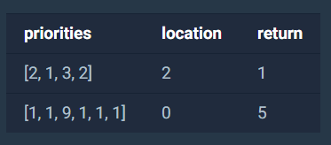

### 1. 문제 설명

문제: https://programmers.co.kr/learn/courses/30/lessons/42587

일반적인 프린터는 인쇄 요청이 들어온 순서대로 인쇄합니다. 그렇기 때문에 중요한 문서가 나중에 인쇄될 수 있습니다. 이런 문제를 보완하기 위해 중요도가 높은 문서를 먼저 인쇄하는 프린터를 개발했습니다. 이 새롭게 개발한 프린터는 아래와 같은 방식으로 인쇄 작업을 수행합니다.


\1. 인쇄 대기목록의 가장 앞에 있는 문서(J)를 대기목록에서 꺼냅니다.

\2. 나머지 인쇄 대기목록에서 J보다 중요도가 높은 문서가 한 개라도 존재하면 J를 대기목록의 가장 마지막에 넣습니다.

\3. 그렇지 않으면 J를 인쇄합니다.

예를 들어, 4개의 문서(A, B, C, D)가 순서대로 인쇄 대기목록에 있고 중요도가 2 1 3 2 라면 C D A B 순으로 인쇄하게 됩니다.


내가 인쇄를 요청한 문서가 몇 번째로 인쇄되는지 알고 싶습니다. 위의 예에서 C는 1번째로, A는 3번째로 인쇄됩니다.


현재 대기목록에 있는 문서의 중요도가 순서대로 담긴 배열 priorities와 내가 인쇄를 요청한 문서가 현재 대기목록의 어떤 위치에 있는지를 알려주는 location이 매개변수로 주어질 때, 내가 인쇄를 요청한 문서가 몇 번째로 인쇄되는지 return 하도록 solution 함수를 작성해주세요.


### 2. 제한사항

\- 현재 대기목록에는 1개 이상 100개 이하의 문서가 있습니다.

\- 인쇄 작업의 중요도는 1~9로 표현하며 숫자가 클수록 중요하다는 뜻입니다.

\- location은 0 이상 (현재 대기목록에 있는 작업 수 - 1) 이하의 값을 가지며 대기목록의 가장 앞에 있으면 0, 두 번째에 있으면 1로 표현합니다.


### 3. 입출력 예




### 4. 입출력 예 설명

예제 #1


문제에 나온 예와 같습니다.


예제 #2


6개의 문서(A, B, C, D, E, F)가 인쇄 대기목록에 있고 중요도가 1 1 9 1 1 1 이므로 C D E F A B 순으로 인쇄합니다.


### 5. 나의 풀이 (알고리즘 해설)

```java
import java.util.LinkedList;
 
public class Document {
    int idx;
    int prioritie;
    
    public Document(int idx, int prioritie) {
        this.idx = idx;
        this.prioritie = prioritie;
    }
}
 
class Solution {
    public int solution(int[] priorities, int location) {        
        LinkedList<Document> list = new LinkedList<Document>();
        
        for (int i = 0; i < priorities.length; i++) {
            list.add(new Document(i, priorities[i]));
        }
        
        //인쇄 순번
        int answer = 1;
 
        //첫번째 Document
        Document firstDc = null;
 
        //대기목록 순차적으로 체크
        while(list.size()>1) {
            firstDc = list.getFirst();
            for (int i = 1; i < list.size(); i++) {
                // 대기목록의 가장 마지막으로
                if (firstDc.prioritie < list.get(i).prioritie) {
                    list.addLast(firstDc);
                    list.removeFirst();
                    break;
                }
                // 인쇄
                if (i == list.size()-1) {
                    if(firstDc.idx == location) return answer;
                    list.removeFirst();
                    answer++;
                }
            }
        }
        return answer;
    }
}
```

LinkedList를 이용하여 간단히 풀 수 있었던 문제였습니다.


(line 3 ~ 11)

중요도와 index가 함께 묶여야할 요소이므로 따로 Document라는 클래스를 정의하여 주어진 배열의 값을 Document로 변환하였습니다.


(line 15 ~ 19)

LinekedList를 생성하여 Document로 변환한 값을 순차적으로 넣어주었습니다.


(line 28 ~ 44)

문제 설명의 1,2,3 번에 나온것 처럼 LinkedList의 가장 처음 값을 firstDc에 저장해두고 그 다음 값과 비교하여 중요도가 더 높은 문서가 있으면 맨 뒤로 보내고 List의 마지막(i=list.size()-1)에 도달하였을때까지 더 중요한 문서가 없다면 인쇄를 합니다.

인쇄가 완료되었으면 인쇄 순번을 올려주면서 위 과정을 반복하게되면 location과 일치하는 index를 가진 문서가 인쇄될 때 answer를 출력하게 됩니다.


(line 45)

list.size()가 1일 경우 마지막 문서이므로 바로 answer를 출력해주면 됩니다.

### 6. point

\- 처음에 코드를 작성할 때 list.size()가 1일 때를 고려하지 않고 코딩하여 몇개의 Test Case가 while 무한루프를 도는 오류가 있었는데 앞으로 더 주의해야겠습니다.