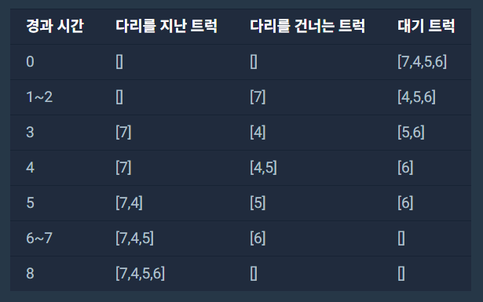
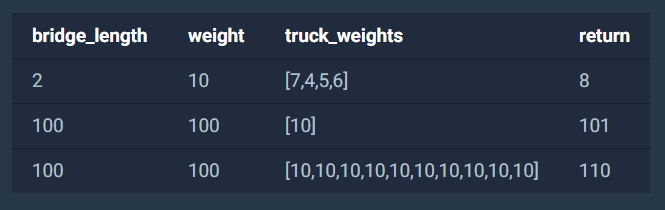

### 1. 문제 설명

문제: https://programmers.co.kr/learn/courses/30/lessons/42583

트럭 여러 대가 강을 가로지르는 일 차선 다리를 정해진 순으로 건너려 합니다. 모든 트럭이 다리를 건너려면 최소 몇 초가 걸리는지 알아내야 합니다. 트럭은 1초에 1만큼 움직이며, 다리 길이는 bridge_length이고 다리는 무게 weight까지 견딥니다.

※ 트럭이 다리에 완전히 오르지 않은 경우, 이 트럭의 무게는 고려하지 않습니다.


예를 들어, 길이가 2대까지, 무게 10kg까지 견디는 다리가 있습니다. 무게가 [7, 4, 5, 6]kg인 트럭이 순서대로 최단 시간 안에 다리를 건너려면 다음과 같이 건너야 합니다.





따라서, 모든 트럭이 다리를 지나려면 최소 8초가 걸립니다.


solution 함수의 매개변수로 다리 길이 bridge_length, 다리가 견딜 수 있는 무게 weight, 트럭별 무게 truck_weights가 주어집니다. 이때 모든 트럭이 다리를 건너려면 최소 몇 초가 걸리는지 return 하도록 solution 함수를 완성하세요.


### 2. 제한사항

\- bridge_length는 1 이상 10,000 이하입니다.

\- weight는 1 이상 10,000 이하입니다.

\- truck_weights의 길이는 1 이상 10,000 이하입니다.

\- 모든 트럭의 무게는 1 이상 weight 이하입니다.


### 3. 입출력 예




### 4. 입출력 예 설명

문제에 나온 예와 같습니다.


### 5. 나의 풀이 (알고리즘 해설)

```java
import java.util.LinkedList;
import java.util.Queue;
import java.util.List;
import java.util.ArrayList;
 
public class Truck {
    int weight;
    int distance;
    
    public Truck(int weight, int distance) {
        this.weight = weight;
        this.distance = distance;
    }
}
 
class Solution {
    public int solution(int bridge_length, int weight, int[] truck_weights) {
        int time = 0;
        int weightLeft = weight;
        Truck truck = null;
        
        Queue<Truck> outside = new LinkedList<Truck>();
        List<Truck> inside = new ArrayList<Truck>();
 
        for (int t : truck_weights) {
            outside.add(new Truck(t, bridge_length));
        }
 
        while (!(inside.isEmpty()&&outside.isEmpty())) {
            time++;
            
            if (!inside.isEmpty() && inside.get(0).distance <= 0) {
                weightLeft += inside.get(0).weight;
                inside.remove(0);
            }
            
            if (!outside.isEmpty() && weightLeft - outside.peek().weight >= 0) {
                weightLeft -= outside.peek().weight;
                inside.add(outside.poll());
            }
            
            for (int i = 0; i < inside.size(); i++) {
                truck = inside.get(i);
                truck.distance--;
            }
        }
        return time;
    }
}
```

Queue, LinkedList를 이용하여 간단히 풀 수 있었던 문제였습니다.


(line 4 ~ 12)

직관적인 문제 풀이를 위해 무게, 남은 이동거리가 Truck이라는 Class를 생성해주었습니다.


(line 16 ~ 18)

시간 time, 남은 견딜 수 있는 무게 weightLeft, Truck을 담을 임시 변수 truck를 생성해주었습니다.


(line 20 ~ 21)

다리 밖 대기중인 트럭을 Queue<Truck> Outside, 다리 위 트럭을 ArrayList<Truck> Inside로 정의하였습니다.

(inside는 순차적으로 line 40~43에서 남은 거리를 for문을 돌며 감소시켜주어야 하기에 ArrayList를 사용하였습니다.) 


(line 30 ~ 33)

먼저 다리위 트럭이 distance이상 지나갔으면 inside에서 제거해주고 남은 무게도 증가시켜줍니다.


(line 35 ~ 38)

남은 무게보다 가벼운 트럭이 있다면 inside로 넣어줍니다.


(line 40 ~ 43)

다리 위 트럭의 distance를 1씩 감소시킵니다.


(line 45)

다리 위, 대기중 트럭 모두 비어있을때 time을 return 해줍니다.

### 6. point

\- 처음에 트럭을 이동시키고 for문 안에서 distance가 0이하인 것을 검사하였는데, List의 맨 앞의 값이 이동거리가 가장 길기 때문에 맨 처음 것만 검사해주면 되었기에 불필요한 연산이 되었습니다. 불필요한 연산은 줄일 수 있도록 해야겠습니다.


\- inside를 처음에 LinkedList로 구현하였는데 그렇게 되면 line 42에서 .get(i) 연산을 할 때 ArrayList는 O(1), LinkedList는 O(n)시간이 소요되므로 더 많은 복잡도가 생겨 ArrayList로 바꾸었습니다. 물론 삽입 삭제는 반대로 ArrayList는 O(n), LinkedList는 O(1) 으로 ArrayList가 불리하지만 삽입/삭제되는 횟수(트럭수*2)보다 Truck이 이동하는 횟수(트럭수*다리 길이)가 더 많으므로 이동에 더 유리한 ArrayList를 적용하여야 복잡도가 줄어들 수 있겠습니다.