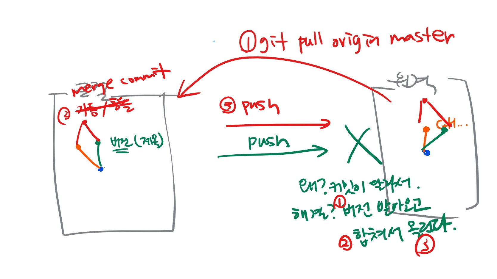

## 전날 복습


> `add` 와 `commit` 을 설명할 수 있는가?

* `add` 는 working directory 에서 staging area 로 넘기는 작업

  - ```bash
    $ git add . 	#  . 은 현재 위치 전체를 뜻함, 혹은 파일이나 폴더만도 가능
    ```

* `commit` 은 staging area 에서 커밋을 하는 작업

  - ```bash
    $ git commit -m '커밋메시지'	# '커밋메시지'로 커밋을 진행
    ```

> `status` 와 `log` 를 설명할 수 있는가?

* `status` 는 working directory 와 staging area 의 상태를 나타내줌
* 

> 커밋하는 과정을 설명할 수 있는가?


> 원격저장소를 만들 수 있는가?


> 원격저장소에 push 할 수 있는가?



